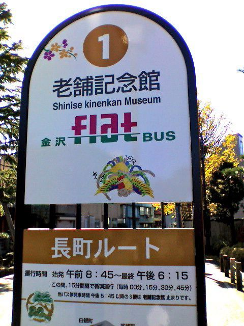
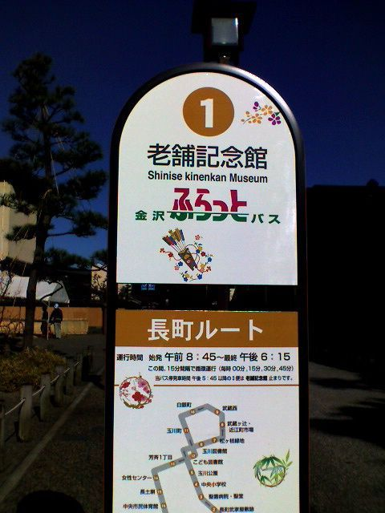

# [mixi] 勘違い

**作成日:** 2008-12-02

金沢市内で路上に駐車してた紺のパンダを見かけた直後に、これと同じバス停を見て、「FIATバス？？？」。ムルティプラが走るイメージが頭をよぎりましたが、定時運行は難しそうな気がする（笑）。

正解は2枚目の写真。

小型の低床バスの路線でした。

---

## イイネ (13)

- マスター毛男
- きたまこと
- KOHJI＠掬水月在手
- ゆみちん
- まほ
- タク
- Buddy
- れてぃ
- arancio
- ケルマデック
- YASUO
- さぁ
- 退会したユーザー

---

## コメント

**マイリスト**

マイミク一覧

**勘違い編集する**

2008年12月02日00:51

**マスター毛男2008年12月02日 10:56**

みえるみえる！

**れてぃ2008年12月02日 12:41**

ムルティプラバス、、、。
しょっちゅう、押し掛けや、坂の途中で後ろを押さなきゃいけない気がする。

**arancio2008年12月02日 21:13**

＞マスター
見えるよね～。イタ車乗りだけ
＞れてぃさん
あんまり乗りたくないですね。
ムルティプラはかわいいけど。

**退会したユーザー2008年12月02日 21:18**

あ、「ＦＬＡＴ」だったんですね！

**arancio2008年12月02日 21:21**

イタ車乗りがまた一人（笑）。

**2026年**

01月
02月
03月
04月
05月
06月
07月
08月
09月
10月
11月
12月