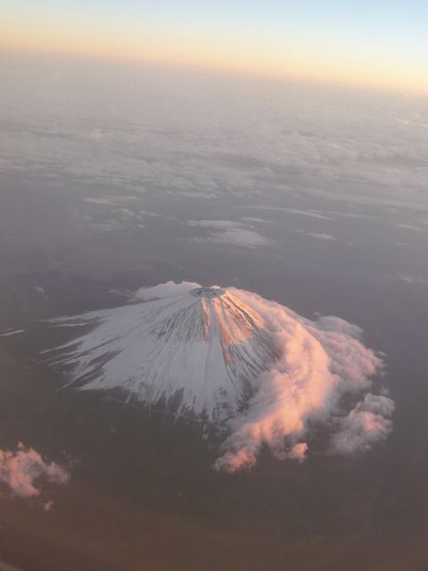
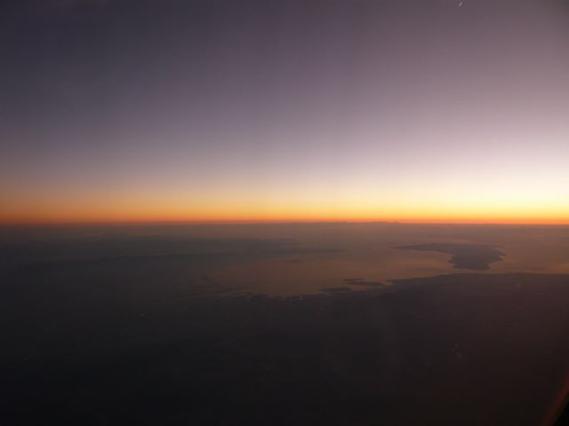

# [mixi] 昨日の上空散歩

**作成日:** 2008-12-02

昨日は東京16:10発の長崎行きに乗りました。

東京は今にも日が沈みそうな感じでしたが、西に向かったので、なが～く夕焼けを楽しめました。

雲は多かったんですが、富士山はきれいに見えました。

大阪上空では美しい夕景を見ることができました。

大阪湾を一望できました。右手が淡路島。

三日月と宵の明星がとってもきれいだったんですが、私のカメラでは撮れそうにないので黙って見てました。

話は変わりますが、、、

羽田で朝青龍を目撃したんですが、二人いた付き人のうちの一人が、まげに浴衣で今風（死語？）のポップな眼鏡をかけて、銀のアタッシュケースみたいなのを持って、携帯をかけながら歩いてたので、そっちの方がインパクト大でした。

---

## イイネ (11)

- きたまこと
- KOHJI＠掬水月在手
- ゆみちん
- まほ
- タク
- Buddy
- arancio
- ケルマデック
- YASUO
- さぁ
- 退会したユーザー

---

## コメント

**マイリスト**

マイミク一覧

**昨日の上空散歩編集する**

2008年12月02日21:21

**退会したユーザー2008年12月02日 21:22**

き、きれい！
私もソウル行きの便で、こんな感じの富士山と伊豆半島を撮影できました♪

**arancio2008年12月02日 21:30**

成田からソウルへ行くのに伊豆半島を通るんですね。
そういえば、今回は長崎→羽田と小松→羽田で木更津あたりを通過してたので2回も沈みかけの船みたいな海ほたるを見ました。
伊豆半島、上空からどんな感じで見えるのか次回チェックしてみます。

**2026年**

01月
02月
03月
04月
05月
06月
07月
08月
09月
10月
11月
12月
