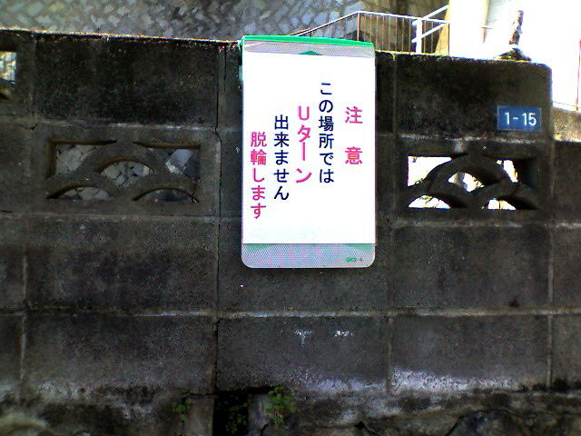

# [mixi] 新しい張り紙

**作成日:** 2009-01-11

近所の車一台がやっと通れる急坂に、こんな張り紙が。

誰か、脱輪したのかなあ。

塀の向こうは、以前建物がありましたが、今は空き地です。

---

## イイネ (12)

- きたまこと
- KOHJI＠掬水月在手
- みにすけ
- ゆみちん
- しのみん
- まほ
- タク
- Buddy
- arancio
- ケルマデック
- YASUO
- さぁ

---

## コメント

**マイリスト**

マイミク一覧

**新しい張り紙編集する**

2009年01月11日16:59

**しのみん2009年01月11日 17:24**

うわ～～～～
なんか、拍手してしまいたくなる貼り紙・・・
実感こもってるぅぅぅぅぅ

**arancio2009年01月11日 17:46**

実感こもりすぎですよね（笑）。

**みにすけ2009年01月11日 23:05**

わかりやすい…けど、ほんまに？ってやってみてしまいそう(笑)
できたで～っＵターンって言いたいかも。

**arancio2009年01月12日 18:48**

ぜひ試しに来てください（笑）。
ミニなら大丈夫かな～。

**2026年**

01月
02月
03月
04月
05月
06月
07月
08月
09月
10月
11月
12月
