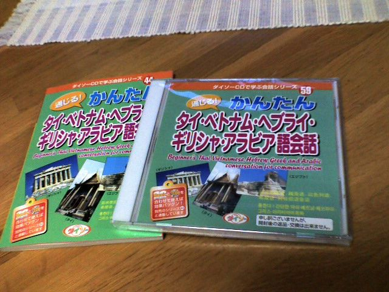

# [mixi] おそるべし

**作成日:** 2009-01-26

シンクはマイクロファイバーの布巾で拭くと良いというのを雑誌で読んで、こういう時はまず百均へってことで、午後に散歩がてらダイソーに行きました。ダイソーに行くのは久しぶりだったのですが、語学書のCDのシリーズがたくさんあってびっくり。音楽とか、落語だとか、浪曲だとかのCDは前からあったけど、教育方面に進出ですか。

一番とりとめのなさそうなやつを本とCDをあわせて買いました。計210円

タイ、ベトナム、ヘブライ、ギリシャ、アラビア語がひとくくりって凄すぎます。「はじめに」に説明はありますが、タイ、ベトナムが人気のある観光地、ギリシャは2004年のオリンピック、中近東圏は世界情勢で常に話題にのぼるからと、とりとめがありません。

内容は特に問題ないです。問題あっても、怒る気はしないけど。

あ、マイクロファイバーの布巾も買いました。

こっちも凄い威力です。軽い汚れとかくもりなら水ぶきでとれて、新品みたいにぴかぴかになりました。もっと早くに知ってたら～って感じです。

---

## イイネ (12)

- きたまこと
- KOHJI＠掬水月在手
- Jane Birkin
- ゆみちん
- まほ
- タク
- Buddy
- arancio
- ケルマデック
- YASUO
- さぁ
- テル

---

## コメント

**マイリスト**

マイミク一覧

**おそるべし編集する**

2009年01月26日01:42

**テル2009年01月26日 01:49**

ちょっとダイソーへ行ってきます（笑）。

**arancio2009年01月26日 01:52**

何か買ったら、ぜひ日記に！

**Jane Birkin2009年01月26日 08:42**

必ず買います。
こういう情報、大好物です。

**arancio2009年01月27日 01:24**

フロアワイパーにつけて使ってもいいらしいです。
ゴミが出なくて良さそう。

**2026年**

01月
02月
03月
04月
05月
06月
07月
08月
09月
10月
11月
12月
