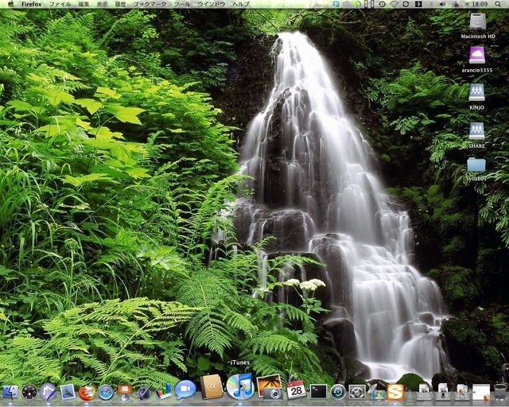
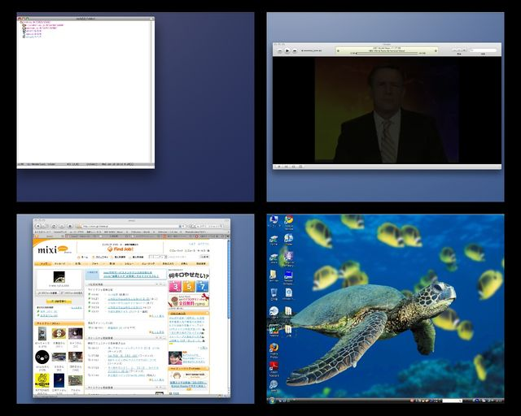

# [mixi] ご指名により

**作成日:** 2009-01-29

久々にバトンやってみます。

■デスクトップバトン■

(マイミク　タマムラさんより)

【ルール】

これを見た人は、必ずデスクトップのスクリーンショットを日記に載せます。執行猶予はありません。

あまりに名誉毀損だという場合には、アイコンやファイル名に修正を加えてかまいません。

しかし、あまり修正しすぎるとおもしろくないのである程度自粛しましょう。

早速すべてのウィンドウを最小化しましょう。

【1】あなたのデスクトップを晒して、一言どうぞ。

地味。

【2】OSは何？

Mac OS X Leopardと、右下のスペースで使ってるのはWindows Vista Business。

【3】これはあなた個人のパソコン？職場や家族共有のパソコン？

職場の個人使用パソコンです。

一人なのに、部屋に計4台ありますね
。

【4】この壁紙は何？どこで手に入れた？

この壁紙は、風水的にオフィスには悪い気を流すみたいな意味で滝や川の写真を飾るといいというのを読んで、壁紙サイトで拾ってきました。もっとご利益がありそうな水辺の写真があったら下さい（笑）。

【5】壁紙は頻繁に変える？

めったに変えません。だいたい風景とか植物の写真にしてます。

【6】デスクトップのアイコンの数はいくつ？

Macは5つ、Vistaは17でした。

ネットワーク上のディスクにデータを置いてて、デスクトップにあるのは作業中のものだけなので、あんまりごちゃごちゃにならない。

【7】ファイルやショートカットがゴチャゴチャしているデスクトップ、許せる？

自分のものだったら耐えられません～。

【8】何かこだわりはある？

仮想画面は絶対必要。でも、2x2の4画面で満足。

それ以上は使いこなせない気がする。

【9】今回、このバトンが回ってきてからこっそりとデスクトップを整理した？

いいえ。あまりに地味なので、4画面一覧してるスクリーンショットもつけときました。

【10】最後に『この人のデスクトップを覗きたい』という5人 

指名はしないけど、デスクトップがアイコン満載とか、仮想マシンで複数のOSを使い倒してるとか、我こそはという人がいたら見せてください～。

あ、このMacは intel Mac (Mac mini)なので、Boot campを入れたらKnoppixが使えるというのをＭac mini関係のブログで読んで、適当に試してみた結果、Boot campを入れなくても、KnoppixのCDをドライブに入れて起動時にオプションキー押しっぱなしにすれば、Knoppix CDから起動できることを昨日発見しました。だからどうやねんと言われると、どうにもなりませんが、まあ、動いたらうれしいってことで。

ちなみにUSBにいれたKnoppixから起動っていうのは無理でした。

---

## イイネ (12)

- きたまこと
- KOHJI＠掬水月在手
- まほ
- ゆみちん
- タク
- Buddy
- arancio
- ぷち
- ケルマデック
- YASUO
- さぁ
- 退会したユーザー

---

## コメント

**マイリスト**

マイミク一覧

**ご指名により編集する**

2009年01月29日13:32

**ぷち2009年01月29日 15:57**

もろもろの規則に引っかかるかもしれないので出せませんが、
壁紙は「週刊ニュース新書」のまーご君です。
まーご君の顔を隠しちゃいけない！という不純な動機で
デスクトップをマメに整理するようになりました（笑）
http://
dogatch
.jp/rec
ommend/
news-sh
insho/m
.html

**arancio2009年01月29日 16:03**

まーご君、かわいいですねえ。
一度、ちゃんとTVで観てみよっと。

**退会したユーザー2009年01月29日 18:06**

ご回答有り難うございます！感激。
仮想画面便利ですよね～。
Macだとあんまりデスクトップに置く必要性が無い　感じがします。
アプリはDockに整理しておけば……。
ふむふむ。水辺の写真見つけたらご連絡しま～す。

**arancio2009年01月29日 21:53**

アプリのフォルダをDockにおく、というアイデアいただきました！
便利ですぅ。目から鱗、でした。

**2026年**

01月
02月
03月
04月
05月
06月
07月
08月
09月
10月
11月
12月
