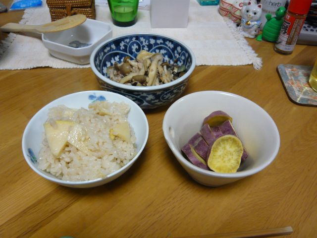
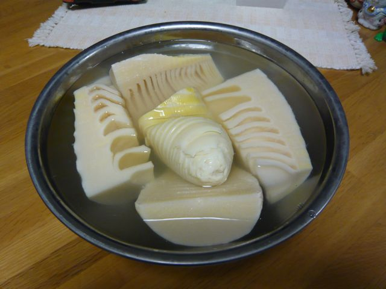

# [mixi] たけのこ

**作成日:** 2009-04-13

安かったし（198円だったかな？）、米ぬかも30円くらいで一緒に売ってたので、11日（土）に生のたけのこを買ってしまい、翌日の日曜にゆでて、月曜ににたけのこパスタを作って食べ、水曜にたけのこご飯を炊いて、木曜はお弁当にたけのこご飯を持っていき、ゆうべも冷凍してあったたけのこご飯を食べて、残ってたたけのこの1/3くらいをきざんで冷凍して、今日月曜に残りをパスタにして（冷凍のは別として）完食の予定でした。

が、今日、立派なゆでたけのこを2つもいただいてしまいました。

1/4くらいはきざんで冷凍した（大きいままで冷凍するとす（鬆って書くのね）が入るらしい）けど、残りはどうやって食べよう。焼きたけのこ、若竹煮、土佐煮、木の芽あえ、くらいしか思いつかない。たけのこご飯量産しかないですかねえ（笑）。

今日は切り昆布としめじと一緒にパスタにしました。みためがとっても地味。

こないだは木の芽高くて買わなかったんだけど、 安く売ってないかな～。

1枚目　生姜入りたけのこご飯

2枚目　今、冷蔵室にあるたけのこ

---

## イイネ (16)

- きたまこと
- KOHJI＠掬水月在手
- ながいけ
- ゆみちん
- まほ
- タク
- Buddy
- れてぃ
- arancio
- ぷち
- ケルマデック
- でんじろう。
- YASUO
- キュ～太郎
- さぁ
- 退会したユーザー

---

## コメント

**マイリスト**

マイミク一覧

**たけのこ編集する**

2009年04月13日22:43

**退会したユーザー2009年04月13日 22:46**

タケノコ一番嫌いな食材です。

**arancio2009年04月13日 22:54**

嫌いな人には地獄ですね
。
支那竹もだめですか？

**れてぃ2009年04月13日 22:59**

天婦羅やフライも中々乙ですよ。刻んでかき揚げも中々。木の芽としらすや桜エビを入れて。
荒炊きにも美味。青椒肉絲も旨いです。
玉味噌でグラタン仕立ても酒盗人です。

**ながいけ2009年04月13日 23:03**

毎日たけのこご飯と若竹汁を食べてます。
幸せです。

**でんじろう。2009年04月13日 23:48**

たけのこいただく時ってめっちゃ重なるよね～！
そんなときはほんとに毎日タケノコ・・・。
でも好きだからうれしいけどね。
そういえばあたしタケノコ好きやけど、シナチク食べられへんっ！

**キュ～太郎2009年04月14日 00:49**

取り立てのたけのこ食べてみたいです

**退会したユーザー2009年04月14日 05:31**

支那であろうと伊奈であろうと竹はだめです。
大人になって色々克服できた食材はあるのですが、竹は無理です。

**退会したユーザー2009年04月14日 08:41**

あ、美味しそうです。
オヤジに連れられて裏山の竹林に掘りに行ったり、家内が喜んで道端に売っている土入りの皮付きの筍をせっせとアクを抜いたりして茹でて食べた柔らかな食感が思い出されます。（涙）

**ぷち2009年04月14日 18:56**

おいしそ～
この間、テレビで味噌煮（炒め？麻婆なすのたけのこ版みたいに）にしてました。
とってもおいしそうでした。

**arancio2009年04月22日 21:09**

ばたばたしてて日記ごぶさたしてました。
今日たけのことスナップエンドウと薄揚げのパスタを食べて、生のたけのこは消費完了しました。ぎりぎり間に合った感じです。
＞れてぃさん
一人なので揚物はしないんですよね。
下手だし。作らないからいつまでたっても上手になれないんですが（笑）。
実家で食べるか、お店で食べます。
＞ながいけさん
幸せそうですね～。
誰か作ってくれたら、私も毎日食べます。
＞でんじろう。さん
いただきものの不思議！
シナチクだめな人は多そうですね。
＞キュ～ちゃん
たけのこ掘って、その場で食べてみたいですね～。
＞wolfさん
一つくらい食べられないものがあった方が人生に深みがあっていいのかも（笑）。
＞Ｊさん
掘りたてのたけのこおいしそうですね～。
＞ぷちさん
ぷちさんの書き込みをみて、名古屋土産の「つけてみそ、かけてみそ」（ネーミングがアレですが）があるのを思い出し、豆板醤とまぜて、味噌炒めにしてみました。なかなかいけました。

**2026年**

01月
02月
03月
04月
05月
06月
07月
08月
09月
10月
11月
12月
