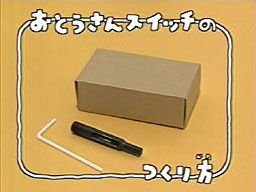

# [mixi] 今日のおとうさんスイッチ

**作成日:** 2009-05-13

出演者は、片桐仁と愛息の太朗（４さい）くんでした。

二人ともかわいくて（笑）、とっても幸せな気分になりました～。

おとうさんスイッチはフツー子どもが作るものみたいですが、明らかに片桐仁作の重そうなおとうさんスイッチもスペシャルでした。写真はフツーのおとうさんスイッチの材料。片桐バージョンが見たい人は「片桐仁　おとうさんスイッチ」でググって下さい。

相方と違って、片桐親子は雑誌などよく露出してます。

ミスチル『エソラ』PVも素敵でした。

---

## イイネ (11)

- きたまこと
- KOHJI＠掬水月在手
- ゆみちん
- まほ
- わた
- タク
- Buddy
- arancio
- ケルマデック
- YASUO
- さぁ

---

## コメント

**マイリスト**

マイミク一覧

**今日のおとうさんスイッチ編集する**

2009年05月13日17:54

**わた2009年05月13日 19:17**

「おばさんスイッチ」をやってみたくて、甥（7歳）を誘ったけど拒否されました。アルゴリズム体操もやってみたくて誘ったけど、「はずかしい」と拒否されました
その昔、arancioさんのお○ぱいを、背伸びして突然さわり「えーっ
ちょっとどんなんかなあ、と思って・・・。」という名言を吐いた甥（当時4歳だったっけ？）は、今年高校に入学し、軽音でエレベを始めました。
彼は今でも7歳の弟より、めっちゃノリがよくておちゃらけまくってますが、それを見て弟のほうは「おにいちゃん、バカみたい・・・」ってよくゆうてます・・・。

**arancio2009年05月13日 20:15**

触られたっけ～？小さいうちの特権ですね。みんな触るわけじゃないけど。
名言といえば、お母さんに「（音楽教室の先生の）どこが良かった？」って聞かれて「足」と答えてたのも名言だったと思います。
「けいおん」流行ってるみたいですね。

**わた2009年05月14日 18:47**

＞みんな触るわけじゃないけど。
ほんと、すみませんでした。次回お会いする機会があれば、たぶんもう触らないと思いますので。
＞お母さんに「（音楽教室の先生の）どこが良かった？」って聞かれて「足」と答えてたのも名言だったと思います。
これ、初耳です。読んで爆笑しました！
同じく4歳ぐらいのときに、「も～。おばあちゃんはぼくのおち○ち○ばっかりすきがる（好きがる？？）から～。」と言ってたのもかわいかったなあ。
基本的に幼児は下ネタ好きですもんね。いや、大人もか。
「けいおん」流行ってるんですか？　え？どこで？

**arancio2009年05月14日 21:27**

触っても怒られないというのはある種の才能だと思うけど、そんな危険な才能はいらないか～（笑）。
「けいおん」見たことないんですが、こんなニュースをみかけるので…
http://news.mixi.jp/view_news.pl?id=833832&media_id=32

**2026年**

01月
02月
03月
04月
05月
06月
07月
08月
09月
10月
11月
12月