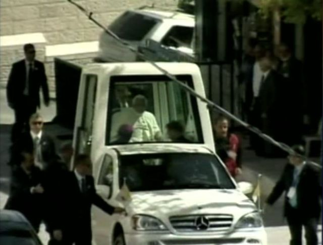

# [mixi] 法皇の車

**作成日:** 2009-05-15

現代の牛車って感じですね。

ロールスロイスじゃないんだ。

---

## イイネ (11)

- きたまこと
- KOHJI＠掬水月在手
- ゆみちん
- まほ
- タク
- Buddy
- arancio
- ケルマデック
- YASUO
- さぁ
- 大ちゃん＠ﾗﾃﾝ大阪

---

## コメント

**マイリスト**

マイミク一覧

**法皇の車編集する**

2009年05月15日12:54

**大ちゃん＠ﾗﾃﾝ大阪2009年05月16日 10:47**

前のヨハネパウロ2世が狙撃された時に、どこかの国の信徒から献上されたのが初めだったらしいです。
確か70年代ぐらいまでは、大きな椅子に担ぐ棒がついた輿みたいなのに乗って儀式に出ていたみたいです。
最初からベンツなのか、今の法王がドイツ出身だからベンツなのかどっちなんでしょう？

**arancio2009年05月17日 00:36**

やっぱりドイツ出身だから？
今回のイスラエル訪問は聖地巡礼の一環みたいですが、もう一つ意図がわかりません。何かが解決するというより、火に油を注ぐだけのような気がするんですが。
ローマ教皇庁のホームページ見てみたら、中国語、ドイツ語、英語、スペイン語、フランス語、イタリア語、ラテン語、ポルトガル語の8カ国語が選べます。
ラテン語は別として、ドイツ語を話すカトリック信者が一番数が少なそうな気がします。

**大ちゃん＠ﾗﾃﾝ大阪2009年05月17日 01:03**

なんか、問題発言とかも結構してますよね。
やっぱりダントツでスペイン語なんでしょうか。ポルトガル語も多いかな。
ドイツ語よりも英語が少ないような気も・・・・。
英語圏って、カトリックはマイノリティっぽい気がします。

**arancio2009年05月17日 02:06**

フィリピンなんかもあるし、ドイツ語に負けることはないと思うのですが（笑）。

**2026年**

01月
02月
03月
04月
05月
06月
07月
08月
09月
10月
11月
12月