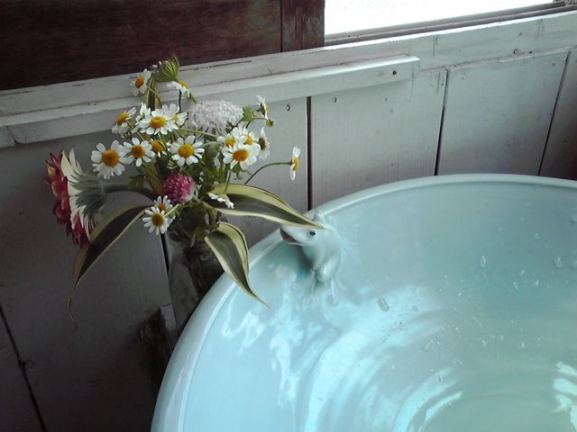

# [mixi] 波佐見のカフェにて

**作成日:** 2009-05-25

洗面所のカエルとお花がかわいかったので、写真を撮ってみましたが、葉っぱがかぶって、謎の生物になってますね
。

ランチを食べて雑誌を読んでたら、フランス語のWaltz for Debbyが流れてきて、聞き覚えのある声にもしやと思ってお店の人にCDですか？と聞いてみたら有線の放送で、お店の人がオンエアリストを調べてくれました。曲はLa BossaのValse pour Debbyでした。La Bossaの女性ヴォーカルの谷さんは、京都にいた頃一時同じ職場にいたのです。長崎の山あいのカフェで、知人の歌声が流れてくるって不思議な感じ。

英語より、フランス語ができた方がずっとかっこいいですね～。

---

## イイネ (13)

- きたまこと
- KOHJI＠掬水月在手
- ゆみちん
- まほ
- YASUO
- タク
- Buddy
- arancio
- ぷち
- ケルマデック
- 団員Ｄ
- さぁ
- 退会したユーザー

---

## コメント

**マイリスト**

マイミク一覧

**波佐見のカフェにて編集する**

2009年05月25日22:41

**ぷち2009年05月25日 23:00**

この角度だとムーミンのようにも見えます。
色とかつるんとした質感とかもちょうど…

**arancio2009年05月25日 23:05**

ちょっとスマートなムーミン
？

**団員Ｄ2009年05月25日 23:51**

ご存知のように、フランス語と讃岐弁は似ていますが、間違ってもカッコイイとは言えません（苦笑）

**arancio2009年05月26日 00:09**

要潤がしゃべってたら、かっこいいかも（笑）。
ほんとは、三枚目やってる要潤の方が好きですが。

**退会したユーザー2009年05月26日 09:42**

フランス語より日本語ができた方がかっこいい気がする。

**arancio2009年05月27日 01:35**

漢字書けるのはかっこいいと思います。
しゃべりっぷりは、関西人ならフランス人に負けないかな。

**2026年**

01月
02月
03月
04月
05月
06月
07月
08月
09月
10月
11月
12月