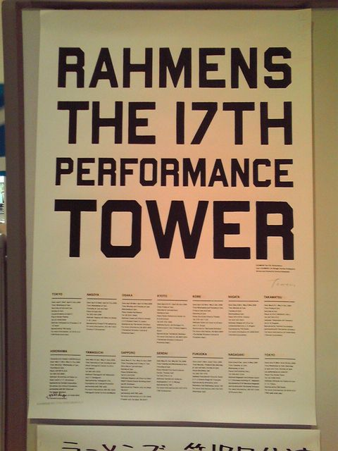

# [mixi] ラーメンズ第17回公演『 TOWER 』

**作成日:** 2009-06-11

先週福岡初日を観て、火曜に長崎初日（って2日2公演しかなかったけど）を観て、長崎公演のメッセージを読んで私の『TOWER』週間が終わりました。

長崎楽日の水曜は大雨だったので、ご当地タワー写真はどうなるんだろうと心配してましたが、今日晴れの西海橋から針尾無線塔を背にした写真がアップされてました。撮影は今日だったんですね。西海橋行きたかった。

以下、ネタバレあり。

小林賢太郎が、爆笑コントはやらない、みたいなことを何度も言ってたような気がしますが、『TOWER』は笑いをこらえるのがつらいほどでした。あやとりのくだりから、苦しかったですね～。今までと違い、音楽も派手に使ってました。というか、無限音階が影の主役でした。この調子で、次々予想をくつがえしていって欲しいと思います。

後から考えれば、Potsunen maruから TEXTへの流れがあって、DropからTOWERの流れということですんなり腑に落ちる感じですが。五重の塔の話とDropのラストの切れっぷりは似てたなあ。個人的には、こんな感じで、ラーメンズとポツネンが続いていくといいなあと思います。

長崎の会場は誘導灯が消えなくて（青のフィルムを貼って対策はしてたけど）暗転の時に客席が真っ暗にならなくて残念でした。わくわく感が2割減ってところでしょうか。昔はどこの劇場も誘導灯って消えなかったけど、今は消してるところも多いのにね。こういうところが田舎なんだろうな～。

物販で『粘土道完全版』（サイン入り『粘土道』持ってるんですが）と『おしり』買いましたが、ハズレでした。当たりの方がいたら、画像見せて下さい（笑）。

---

## イイネ (9)

- きたまこと
- KOHJI＠掬水月在手
- ゆみちん
- まほ
- タク
- Buddy
- ケルマデック
- YASUO
- さぁ

---

## コメント

**マイリスト**

マイミク一覧

**ラーメンズ第17回公演『 TOWER 』編集する**

2009年06月11日22:22

**2026年**

01月
02月
03月
04月
05月
06月
07月
08月
09月
10月
11月
12月
