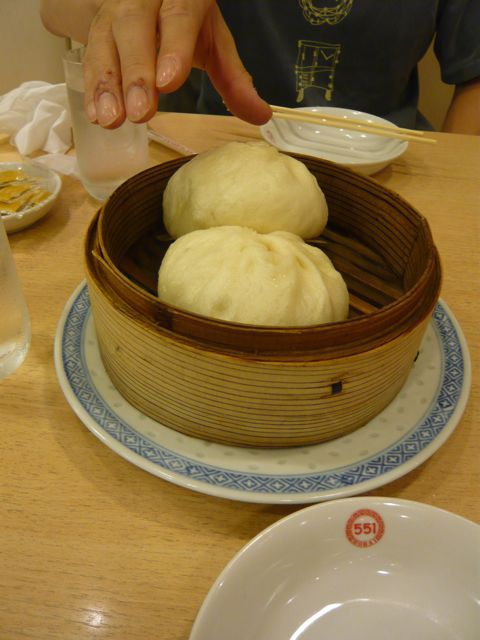
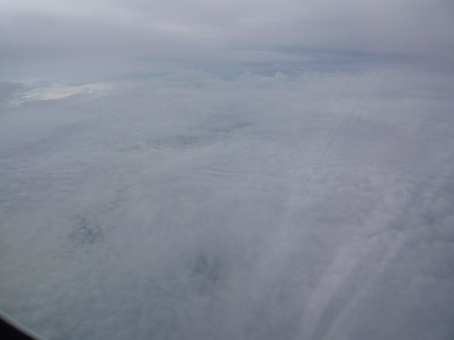

# [mixi] 誕生日

**作成日:** 2009-07-22

20日の誕生日は、大阪で迎えました。

前日は十三でねぎ焼きを食べ、誕生日当日は正午前に梅田の地下街で生ビールを飲んで串かつを食べてました。11時過ぎの串かつ屋はシニアの方々でほぼ満席で、食べる量というか、飲む量というか完全に負けてる感じでした。

その後、阪神難波線に乗ってみようかと阪神梅田駅に向かったものの結局難波には行かず、改装した甲子園を見学し、締めは伊丹の蓬莱で豚まんを食べ、帰りの飛行機の座席が窓際K席で、伊丹離陸後、上空から阪神競馬場、甲子園を見学し、大阪観光を満喫しました。

2枚目の写真は（たぶん）中国地方付近で撮影した「停滞している前線」と思われる上空の様子です。

---

## イイネ (14)

- きたまこと
- KOHJI＠掬水月在手
- Jane Birkin
- まみさん
- ゆみちん
- まほ
- タク
- Buddy
- れてぃ
- arancio
- ケルマデック
- でんじろう。
- YASUO
- さぁ

---

## コメント

**マイリスト**

マイミク一覧

**誕生日編集する**

2009年07月22日00:12

**でんじろう。2009年07月22日 01:02**

お誕生日おめでとうございます！(ございました？)
大阪満喫だったのですね～♪
読んでたら串カツ食べたくなってきた…(よだれ)

**れてぃ2009年07月22日 01:34**

後れ馳せながら、お誕生日おめでとうございます。
来年はぜひ、ウチで！

**Jane Birkin2009年07月22日 10:15**

お誕生日おめでとうございました(^ヮ^)
十三って読めるようになったのは京都に住んでからです！
それまでは「じゅうさん」もしくは「伊丹十三」より「じゅうぞう」

**arancio2009年07月22日 10:36**

みなさん、ありがとうございます～。
＞でんじろう。さん
私が行ったのは「鳥の巣」というお店でした。おいしかったですよ。
＞れてぃさん
来年の誕生日を待たずに、お伺いしたいと思ってます（笑）。
よろしくお願いします。
＞Janeさん
考えてみると「じゅうぞう」も難しい読みですねえ～。

**まみさん2009年07月23日 08:28**

遅くなりましたが
お誕生日おめでとうございます。
よい一年を(^O^)/

**arancio2009年07月23日 10:53**

まみさん、ありがとうございます。
良い一年になるようがんばります～。

**2026年**

01月
02月
03月
04月
05月
06月
07月
08月
09月
10月
11月
12月