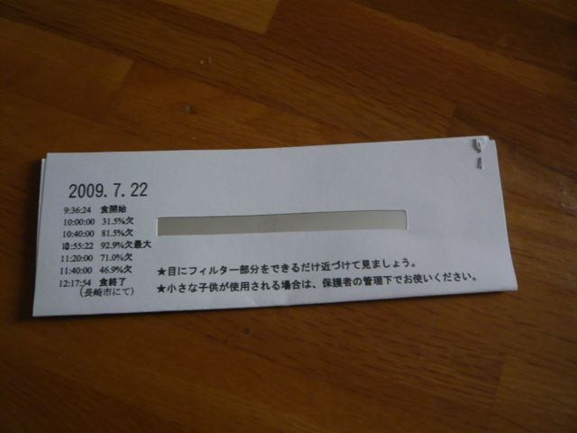
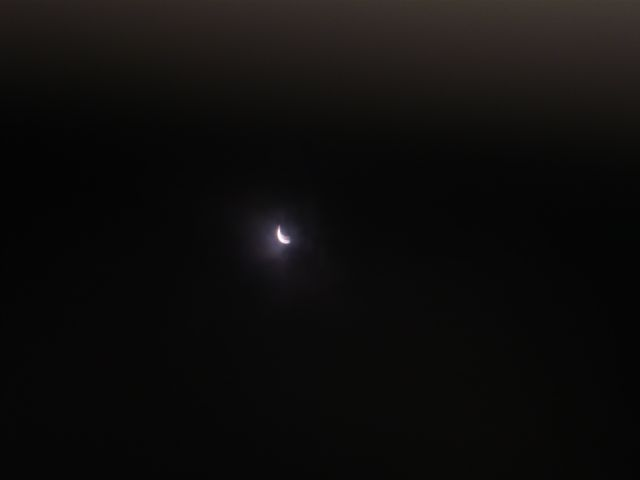
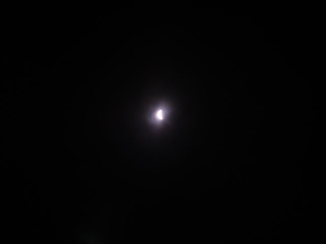

# [mixi] 日食観測

**作成日:** 2009-07-22

自宅ベランダから観測してます。

かけ始めは薄曇りだったので見えたのですが、雲が厚くなってきて、今はぜんぜん見えません。晴れる気配はなさそう～

～～～

写真追加しました。

その1　今回使ったフィルタ。大学でもらった。

その2　10:52ごろ

その3　10:58ごろ

約93%の日食でもあんまり暗くならなかったです。

温度が下がった感じはしたけど。

皆既日食はレベル違う感じですねえ。

---

## イイネ (10)

- きたまこと
- KOHJI＠掬水月在手
- ゆみちん
- まほ
- タク
- Buddy
- arancio
- ケルマデック
- YASUO
- さぁ

---

## コメント

**マイリスト**

マイミク一覧

**日食観測編集する**

2009年07月22日10:31

**arancio2009年07月22日 10:37**

と思いましたが、けっこう風があるようで雲が流れて、さっき三日月の状態になったのが見えました。

**2026年**

01月
02月
03月
04月
05月
06月
07月
08月
09月
10月
11月
12月
