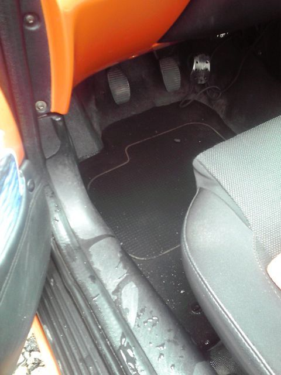
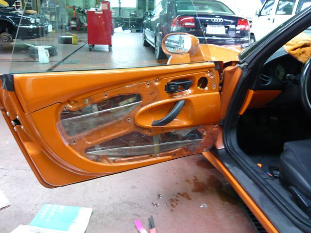

# [mixi] もう降らないでね

**作成日:** 2009-07-27

金曜の夕方、憂鬱な緊急会議を済ませて帰宅したら、雷つきの豪雨が降り始め、3日間、大雨警報やら洪水警報やらが続きました。降り始める前に帰宅できたのはラッキーですが、バケツをひっくり返したような雨が断続的に続いておちおち買い物にもでかけられない週末でした。

ずっとバケツじゃないだけましだし、被害がないことを思えば幸せですが。

うちのバルケッタは、これまで年に1回くらいしか車内に水たまりができませんでしたが、今年はすでに3回水たまりができてます。フツーの雨なら大丈夫なので、車ではなく、雨の降り方がおかしいのだと思いたい。

で、今日の午後、雨がやんだすきをみはからって、水汲みにいったら、車体側のドア部分のモール？にあやしげなすきまを発見。ビニールテープでもはって応急処置しようかなと思ったのですが、よけい悪くする可能性もありそうなので工場に電話したら、とりあえず来てください、とのこと。雨もやんでたので、出かけてきました。

結局、ドアのうちばりのビニールに問題があるようだということになり、バルケッタは予想外の入院をすることになってしまいました。

なおるといいなあ～。

---

## イイネ (9)

- きたまこと
- KOHJI＠掬水月在手
- ゆみちん
- まほ
- タク
- Buddy
- ケルマデック
- YASUO
- さぁ

---

## コメント

**マイリスト**

マイミク一覧

**もう降らないでね編集する**

2009年07月27日02:51

**2026年**

01月
02月
03月
04月
05月
06月
07月
08月
09月
10月
11月
12月