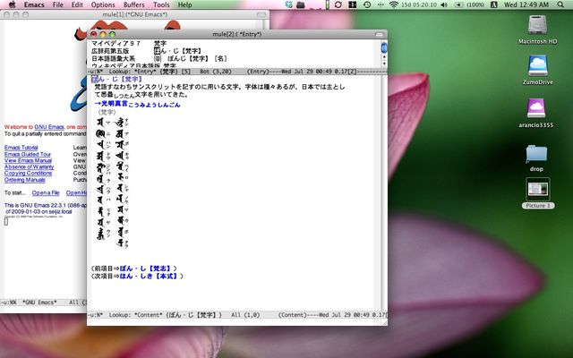
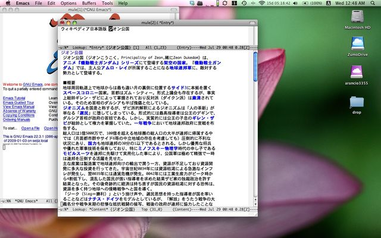

# [mixi] 新しいMacとEmacs

**作成日:** 2009-07-29

2週間ほど前に新しいMacBookが届きました。あまり評判がよくないProの13インチです。PowerBook G4から移行した私は満足してます。

大きな問題もなく、PowerBook からの移行が済んだので、PowerBookではできない、というかやりたくないようなことをやってみようと、wikipedia をEPWINGに変換して iPod touchでみる、というのをやってみることにしました。

変換はうまくいってそうなのに、最後でエラーみたいなことを何回かやって、変換スクリプトの配布元のページにたどりついたら、perlの問題であることが判明し、乗りかかった船というか、毒をくらわば皿までという気分でperlから作り直して再挑戦。

めでたくデータ変換が済み、iPod touchのiDicでwikipediaが読めるようになりました。ぱちぱち。外でもオフラインでもwikipediaが読めます。

MacBookではEmacsというエディタを使ってて、辞書モードがあるのでそれを愛用してるので、変換したwikipediaデータを追加することにしました。それだけなら、1分ほどで終わったのですが、どうせなら音声も聞けるようにしよう（iPod touch のiDicは音が聞ける）と欲張って、いろいろとはまってしまいましたが、大雨でうちにこもってる間にごにょごにょして何とかなりました。

無事、Emacsでもwikipediaがひけ、キー一つで音が出るようになりました。

音が出るのは、研究社の英和中辞典の一部単語と広辞苑のおまけの鳥の声とか音楽とか。鳥の声、いやされます。

Emacsからひくウィキペディア、予想以上に快適でした。

ブラウザに移動して検索するのと、手元のエディタから広辞苑とかと一緒にひけて、検索結果を比較できるのって、格段に快適です。（wikipediaの図表なんかがみたければブラウザで見るしかないですが。）

いろいろ並べて検索すると、広辞苑の偉大さがよくわかります。

一つ残念なのは動画がみられないこと。私の技量では無理そうなのであきらめました。でも、動画の必要性はあんまり感じられないので良しとします。

広辞苑に「二丁投げ」の動画があることはわかってますが、他にどんな動画があるかよくわかりません。

効率よく辞書がひけるようになったけど、仕事の妨げにならないようにしよう
。

1枚目　広辞苑ってすてき

2枚目　ウィキペディアならこんなことも

---

## イイネ (9)

- きたまこと
- KOHJI＠掬水月在手
- ゆみちん
- まほ
- タク
- Buddy
- ケルマデック
- YASUO
- さぁ

---

## コメント

**マイリスト**

マイミク一覧

**新しいMacとEmacs編集する**

2009年07月29日01:51

**2026年**

01月
02月
03月
04月
05月
06月
07月
08月
09月
10月
11月
12月