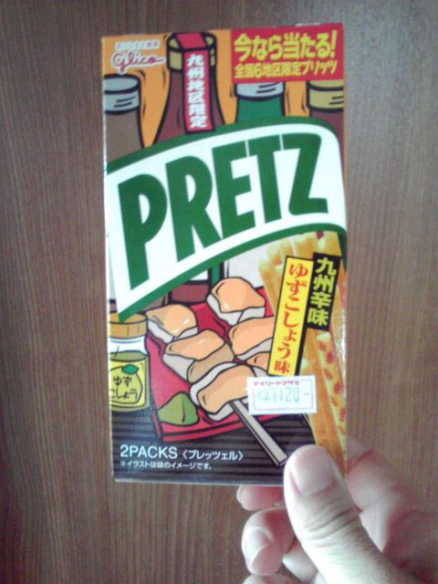

# [mixi] ディアボロ・ジンジャーを探して

**作成日:** 2009-08-04

キリンのディアボロ・ジンジャーの復活を知って、これは飲まねばと近くのコンビニに行ってみたけど売ってなかったので、別のコンビニに行って見つけたのがこれ。

生協にもなかったんですよね～。

確か去年の夏は売ってたんですけど。

ディアボロ・ジンジャー、どこにあるの～。

地域限定プリッツは6種類あるみたいだけど、全国制覇は難しいかな。

---

## イイネ (12)

- きたまこと
- ほいほい
- KOHJI＠掬水月在手
- ゆみちん
- まほ
- タク
- Buddy
- arancio
- ぷち
- ケルマデック
- YASUO
- さぁ

---

## コメント

**マイリスト**

マイミク一覧

**ディアボロ・ジンジャーを探して編集する**

2009年08月04日19:44

**ぷち2009年08月04日 20:38**

去年もあったのですか？
そっちの方が謎というかうらやましいです。
ちなみに私はサンクスで見つけましたよ。

**arancio2009年08月04日 21:35**

サンクスは近くに（たぶん長崎県下も）ないですね～。
地道に探します。
生協で売ってたのは去年じゃなくて、おととしかも。
初めて買ったのが生協だったので、なんとなく記憶にあります。

**ほいほい2009年08月05日 09:13**

職場内のヤマザキデイリーにありましたよん♪
ただ、恐らくあそこの売上げは全国ランク相当高いので、かなり最新の商品が入ってるのは間違いないですが。

**arancio2009年08月05日 22:01**

残念ながら、もよりのヤマザキにはありませんでした。
今日、ちょっと離れたローソンで入手しました。
最新の商品があるコンビニ、楽しそうですねえ。

**ほいほい2009年08月06日 10:04**

最新だけでなく、「オートメカニック」みたいなマニアな雑誌も置いてます。
社内で3～4人読む人が居るらしく、入荷が3部なのでたまに遅れをとります(>_<)

**arancio2009年08月06日 22:33**

「オートメカニック」争奪戦ですか～。熱いコンビニですね。
奥が深いなあ。

**2026年**

01月
02月
03月
04月
05月
06月
07月
08月
09月
10月
11月
12月