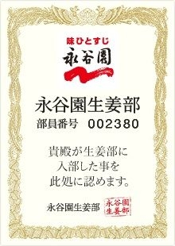

# [mixi] 永谷園生姜部

**作成日:** 2009-08-04

バリでジンジャーティーを飲んで、生姜にはまりました。

冷えの改善にと生姜紅茶を飲み始めて数年、（真夏以外は）飽きずに飲んでます。

その頃すでに友達が生姜紅茶ダイエットしてたりとか、ひそかにしょうがブームが続いてる気がします。佐伯チズは「しょうがヨーグルト」をすすめてたし。

コンビニで見つけた商品に永谷園の「冷え知らず」さんの生姜シリーズというのがあります。ドライの生姜チップが入ってて、マニアも納得の味わいです。

先日たまたまこの商品を開発した人がTVに出てたのですが、冷えに悩む女性で、なんか納得してしまいました。マニアが作ったのね。

永谷園、生姜部まであります。おそるべし。

http://www.shouga-bu.com/

---

## イイネ (11)

- きたまこと
- KOHJI＠掬水月在手
- ゆみちん
- まほ
- タク
- Buddy
- arancio
- ぷち
- ケルマデック
- YASUO
- さぁ

---

## コメント

**マイリスト**

マイミク一覧

**永谷園生姜部編集する**

2009年08月04日23:29

**ぷち2009年08月05日 11:48**

うちにも「冷え知らずさんの　生姜担々スープ」がありました。
思わず手にとってしまったもの。効能うんぬんを抜きにしても、
単純においしいです。残りの1袋は夜中の非常食として待機中。

**arancio2009年08月05日 21:57**

カロリーも低くてうれしいですよね～。

**2026年**

01月
02月
03月
04月
05月
06月
07月
08月
09月
10月
11月
12月