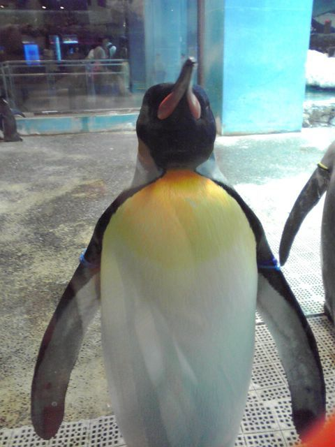

# [mixi] 聞いてたの？

**作成日:** 2009-08-08

少し前からバルケッタの速度計が時々ご機嫌ななめになって動かないのですが、10分も走れば動きだすし、工場の人も動いてない時でないと調べられないということで様子を見てました。

今週の火、水、木、金と速度計が動かないので、工場に行くことにしました。職場で少し仕事をかたづけて、ファミレスで昼食をとって、工場に「今から行きます」と電話をかけて、駐車場を出て、ふと速度計を見たらちゃんと動いてます。orz 行くと言ったので、工場へは行ったものの、なすすべもなく、アイスコーヒーをごちそうになって工場を後にしました。

そのまま帰るのも悲しいので、工場近くの長崎ペンギン水族館でペンギン見てきました。

一番大きい水槽で泳いでるペンギンがほとんどいなかったのが残念ですが、それでも癒されますね。アルバムに写真あげときます。癒されたい人はどうぞ。

---

## イイネ (11)

- きたまこと
- KOHJI＠掬水月在手
- ゆみちん
- まほ
- タク
- Buddy
- arancio
- ケルマデック
- YASUO
- さぁ
- テル

---

## コメント

**マイリスト**

マイミク一覧

**聞いてたの？編集する**

2009年08月08日22:57

**テル2009年08月09日 03:37**

ペンギンいいですねえ。
歩いているときはのんびりなのに，水の中に入るとミサイルのような高速移動のギャップが好きなんです。
速度計，直るといいですねえ。速度制限が厳しい所だと体感で調整ってのも難しそう。
メーターの中の細かいところが壊れていると修理が難しそうですよね。速度を検出するあたりの簡単な所の故障だったらよいのですけど。
私のバイクも燃料計が壊れてていつも燃料０表示ですが，修理が面倒そうなのでそのまま乗っています。
オドメーターを見て給油していますが，優しい人は「燃料ないよ！」と声をかけてくれます（笑）。

**arancio2009年08月09日 17:09**

昨日はペンギンの高速移動が見られませんでした。
時々不器用に羽ばたきながら、ゆっくり泳いでる感じで、それはそれでおもしろかったです。
燃料計が壊れてると、うっかりガス欠が怖いですね。
私はやらかしちゃうだろうなあ（笑）。
速度計は今日は動きませんでした。近くに買い物に得ただけなんで、10分ほどしか運転してませんが。

**2026年**

01月
02月
03月
04月
05月
06月
07月
08月
09月
10月
11月
12月