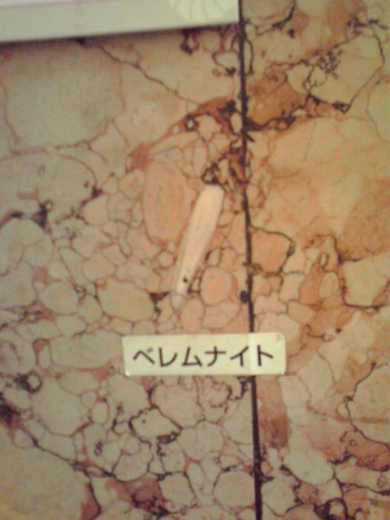

# [mixi] 新宿で化石探し

**作成日:** 2009-08-21

新宿の三越で買い物中、階段で壁にむかってしゃがみ込んでるお兄さんを発見。何事かと思い視線の先をみると、大理石？の壁にアンモナイトの化石が。

壁に化石があるところに化石名と解説がありました。

けっこうあるみたい。

これで夏休みの自由研究できそう～。私はしなくていいんだけど。

---

## イイネ (12)

- きたまこと
- KOHJI＠掬水月在手
- まほ
- ゆみちん
- タク
- Buddy
- arancio
- ケルマデック
- YASUO
- さぁ
- 退会したユーザー
- 大ちゃん＠ﾗﾃﾝ大阪

---

## コメント

**マイリスト**

マイミク一覧

**新宿で化石探し編集する**

2009年08月21日20:10

**大ちゃん＠ﾗﾃﾝ大阪2009年08月21日 22:27**

心斎橋の大丸でも化石の解説を見たことがあります。

**arancio2009年08月21日 22:40**

え～、知らなかった。
夏休みの自由研究は、百貨店の化石探しということで。

**退会したユーザー2009年08月22日 09:55**

そうそう、有名ですよね。

**arancio2009年08月22日 23:15**

あ～、有名なんですね～。
知らなかった私がお馬鹿ということでかたづけてもらおうかな～。

**退会したユーザー2009年08月23日 09:42**

そうそう、こんな感じです。
http://
www.mit
sukoshi
.co.jp/
store/1
010/his
tory/li
st05.ht
ml
http://
plaza.r
akuten.
co.jp/e
nt999/d
iary/20
0908060
000/

**2026年**

01月
02月
03月
04月
05月
06月
07月
08月
09月
10月
11月
12月
