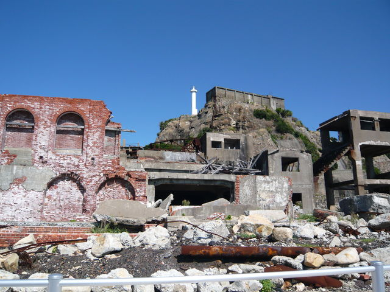
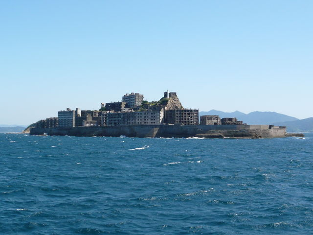

# [mixi] 軍艦島

**作成日:** 2009-09-19

朝9時出発の軍艦島上陸クルーズに参加してきました。

雲一つないみごとな快晴で、船旅も楽しかったです。

天気は良かったのですが、強風だったので、上陸できるかどうか微妙だったみたいですが、無事上陸できました。接岸して、クルーズ船を係留する作業がけっこう大変そうでしたが、きびきびと動く船員さん達がかっこ良かったです。

天気のせいか、軍艦島はあまり不気味な感じがしませんでした。建物は天井が落ちたりとかどんどん変わっているようで、ガイドさんが再訪をすすめてました。3人のガイドさんが案内をしてくれましたが、なかなかおもしろかったです。

mixi動画はサービス終了しました

12時前に長崎港に戻ってきて、昼食を取り、町をうろうろするつもりでしたが、商店街で壱岐の生ウニを買ってしまい、早々に帰宅しました。

1枚目　総合事務所など

2枚目　東沿岸からみた軍艦島

---

## イイネ (12)

- きたまこと
- KOHJI＠掬水月在手
- まほ
- ゆみちん
- タク
- Buddy
- arancio
- ケルマデック
- YASUO
- さぁ
- 退会したユーザー
- 大ちゃん＠ﾗﾃﾝ大阪

---

## コメント

**マイリスト**

マイミク一覧

**軍艦島編集する**

2009年09月19日14:54

**退会したユーザー2009年09月19日 19:06**

すごいですね。
考えてみれば、ローマのコロセウムやフォロロマーナやポンペイ、ギリシャのパルテノンとかも廃墟見物みたいなものですから、日本にもそう言う観光施設？ができて、人々もそれを楽しむようになったということですかね。
兵どもが夢の跡、ですね。

**arancio2009年09月20日 09:41**

建物に近づけないのが残念です。
補修ができて、建物の一部に入れて、地下坑道（軍艦島は炭坑の島）が見学できたら楽しそうですが、補修は無理でしょうねえ。
コロセウムやパルテノンは偉大です。

**大ちゃん＠ﾗﾃﾝ大阪2009年09月22日 01:26**

「廃墟萌え
」ですか？
大阪の「軍艦アパート」（市営下寺住宅）は2～3年前に取り壊されました。
通りすがりに横目で眺めたことはありましたが、もうちょっと詳しく見ておけば良かったと後悔しています。

**退会したユーザー2009年09月24日 11:07**

やはり建物には入れないんだな。
生活用品が残っていて当時を知るにはいいんだけどな。
銭湯とかパチンコ屋とか手術室とか。
もっともベランダなんて朽ち果ててるからかなり危険だけど。

**arancio2009年09月25日 21:43**

＞ 大ちゃん
「廃墟萌え」ではないですが、行ってよかったです。
「軍艦アパート」は見たことなくて残念ですが、大阪市内はおもしろいとこまだありそうですね。
＞ wolfさん
建物はほんとにヤバそうです。
数日前に天井が落ちたばかりというアパートの部屋を離れたところから見ましたが、まわりと色が違ってて落ちたて感がありました。近づきたくはないなあ。
機会があったら、池島で炭坑見学してみます。

**2026年**

01月
02月
03月
04月
05月
06月
07月
08月
09月
10月
11月
12月
