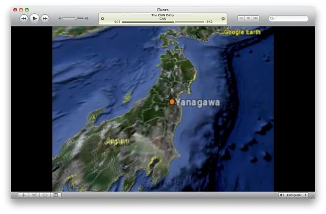

# [mixi] とほほ

**作成日:** 2009-10-04

アメリカ人男性が日本人の元妻のところにいる子供二人を連れ去って、誘拐の容疑で拘留されているそう。男性にも親権があるのに、元妻が子供を連れて帰国したということで、アメリカ国内では男性に同情的な報道がされてるようです。

CNNのニュース（ポッドキャスト）を観たら、子供も元妻も名前も顔もばっちり出てます。

男性はさえない感じですが、元妻はなかなか美人です。

そもそも女性が日本に子供を連れ帰ったことを「拉致」と言っています。

元妻は福岡に実家があり、男性は柳川署に拘留中だということです。

で、そのCNNニュース、冒頭でいきなり柳川の場所が間違ってて、とほほでした。怒っても、現地特派員がリポートしてても、説得力ないよ～。

このYanagawaは福島県伊達市梁川町ってところみたい。

この件を報じたアサヒコムの記事は、誰が書いたんやと問い詰めたいほどわかりにくい文で冒頭部分3回くらい読み返しました。

http://www.asahi.com/national/update/1002/TKY200910010490.html

---

## イイネ (13)

- きたまこと
- KOHJI＠掬水月在手
- Jane Birkin
- ゆみちん
- まほ
- タク
- Buddy
- arancio
- ぷち
- ケルマデック
- YASUO
- さぁ
- 退会したユーザー

---

## コメント

**マイリスト**

マイミク一覧

**とほほ編集する**

2009年10月04日23:33

**ぷち2009年10月05日 00:53**

ハーグ条約のねじれた形が事件になっちゃいましたね。
日本もそろそろこの問題を真剣に考えなくてはいけない
時期なのかもしれません。

**arancio2009年10月05日 01:13**

離婚も問題ですが、ハーグ条約を批准していないことで、日本から国際養子縁組が容易にできるというのも怖いなあと思います。

**退会したユーザー2009年10月05日 01:38**

フランスだと離婚しても双方に親権が残るので、その後もずっと親子が会う権利があるのですが、アメリカでも同じでしょうか。
最近のフランスは、非嫡子が半数を超えるようですし、子連れの再婚も多いので、学校とかでの子供同士の感覚も、親が２名以上いる、と言う感覚が普通になりつつあるようです。

**Jane Birkin2009年10月05日 05:21**

ほんとにわかりにくい記事ですね(^ヮ^;)

**arancio2009年10月05日 18:09**

＞まほろばさん
離婚した親の両方が保護者の役割を果たしている、っていうのはあんまりなさそうな気がします。養育費でさえ踏み倒す人の方が多いようですから。
＞ Janeさん
授業のネタに使えるので、こちらとしてはありがたいのですが。

**2026年**

01月
02月
03月
04月
05月
06月
07月
08月
09月
10月
11月
12月