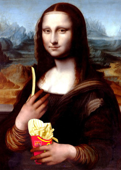

# [mixi] ルーブル美術館にマクドナルド出店

**作成日:** 2009-10-06

フランスはマクドナルドのアメリカ国外で最大のマーケットなんだとか。

http://
www.nyd
ailynew
s.com/r
eal_est
ate/200
9/10/05
/2009-1
0-05_fr
ench_fr
ied_as_
mickey_
ds_inva
des_mon
a_lisas
_lair.h
tml

---

## イイネ (11)

- きたまこと
- KOHJI＠掬水月在手
- ゆみちん
- まほ
- タク
- Buddy
- arancio
- ケルマデック
- YASUO
- さぁ
- 退会したユーザー

---

## コメント

**マイリスト**

マイミク一覧

**ルーブル美術館にマクドナルド出店編集する**

2009年10月06日01:27

**退会したユーザー2009年10月06日 05:08**

アメリカ人を初め、人口以上の外国人観光客が来るしなぁ。（笑）
とは言え、若い子を中心に、フランス人客も多いです。

**arancio2009年10月06日 10:32**

人口以上の観光客ってさすがですね。
日本のマクドナルドは安いですが、海外はどうなんでしょう？
無線LANが使えるので最近ちょくちょく行ってます。

**2026年**

01月
02月
03月
04月
05月
06月
07月
08月
09月
10月
11月
12月
