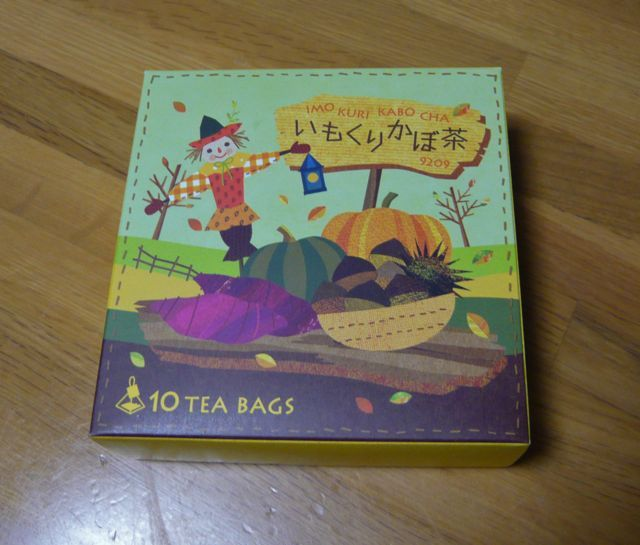

# [mixi] いもくりかぼ茶

**作成日:** 2009-10-10

ルピシアにいつも飲んでるシロニバリを買いに行ったら、今日の試飲は「いもくりかぼ茶」でした。名前の通り、いもくりかぼちゃっぽい甘い香りがします。

空腹感をなだめるのにいいかと思って職場用にティーバッグを買いました。

まんまとやられてます
。

---

## イイネ (11)

- きたまこと
- KOHJI＠掬水月在手
- ゆみちん
- まほ
- タク
- Buddy
- arancio
- ぷち
- ケルマデック
- YASUO
- さぁ

---

## コメント

**マイリスト**

マイミク一覧

**いもくりかぼ茶編集する**

2009年10月10日22:57

**ぷち2009年10月11日 13:27**

ルピシアというと、サントリーと共同開発？した超高級ウーロン茶が気になります。

**arancio2009年10月11日 18:21**

今度お店に行ったらみてみます。
中国茶は、高いのはキリがないですからね～。
偽物も多いみたいので、高いのは怖くて買えないな。

**2026年**

01月
02月
03月
04月
05月
06月
07月
08月
09月
10月
11月
12月