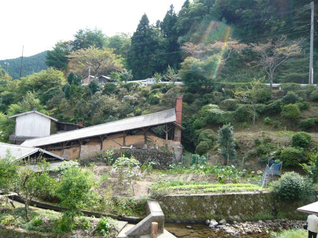
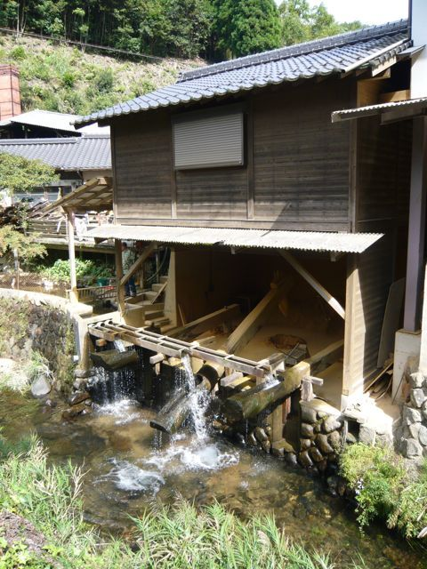
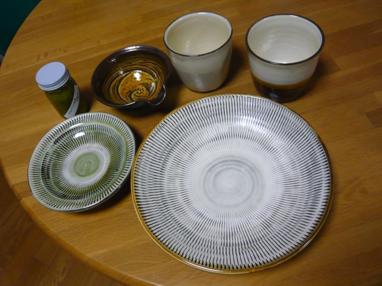

# [mixi] 小鹿田焼民陶祭

**作成日:** 2009-10-11

連休の中日で、天気も良かったので、日田の小鹿田（おんた）の里で行われてる「小鹿田焼民陶祭」へ行ってきました。小鹿田焼には興味があって、ちょうど雑誌で民陶祭の記事を読んで、これは行ってこいというお告げだろうと思って、日田まで出かけて来ました。

10時過ぎに出発、1時前に着きました。10軒の窯元がある小さい山里にわんさか人が集まってました。

そば屋さんの店先で鮎を炭火で焼いてましたが、小銭が足りなかったので、まず200円の抹茶セットで腹ごしらえ。お皿2枚を買ってお金をくずしてから、鮎を食べました。大きな鮎でおいしかったです～。

窯元ごとに強い個性があるわけではなく、銘も入っていないですが、ビミョーに違います。10軒しかないので、1時間もあれば見て回ることができます。陶土をくだくのに川の水で動かす唐臼というのを使っていて、その音がとても風情がありました。川の水もきれいで、大きな鯉が泳いでたりして、いい景色でした。鮎を食べてから、いくつか買い物して、早めに帰途につきました。

帰りにことといの里というところで、日田出身の筑紫哲也の遺品展をやってました。スーツやシャツが展示されてましたが、思ってたより大柄な人だったみたい。20年くらい前と思われる忌野清志郎とのツーショット写真が泣けました。

行きにことといの里の近くのパーキングにセブンが10台以上集まってました。

帰りは日田の町中で20台くらいの珍走団を見ました。2,3台の珍走団風バイクは時々見るけど、団体を見るのは20年ぶりくらいじゃないかな。この人たち保護した方がいいかもしれませんね。バイクは色は派手ですが、竹槍とかはついてなくて、背もたれがやたら長かったです。「紫美香女」とか書いてあったけど、さっぱりわかりません。誰かわかりませんか～。

鳥栖の手前でちょろっと渋滞してましたが、後はすんなり。

1枚目　登り釜

2枚目　唐臼　陶土を砕くのに使われてます

3枚目　本日の戦利品　お皿はうちで見た方が比べるものがないせいかよく見えます（笑）。

---

## イイネ (12)

- きたまこと
- KOHJI＠掬水月在手
- ゆみちん
- まほ
- タク
- Buddy
- れてぃ
- arancio
- ぷち
- ケルマデック
- YASUO
- さぁ

---

## コメント

**マイリスト**

マイミク一覧

**小鹿田焼民陶祭編集する**

2009年10月11日20:15

**ぷち2009年10月11日 21:00**

仕事に飽きて検索しました。ＣＢＸ400をこよなく愛する全国組織の
旧車会「紫美香達」（しびこーず）の、女性チームのことと思われます。ぐったり。
小鹿田焼は素朴でよいですね。弟子を取らない一子相伝というのも
どこかミステリアスな感じがします。

**arancio2009年10月11日 21:21**

ありがとうございます！
なんと全国組織だったとは。
確かに女の子のライダーいました。ピンクのバイクも見ました。
小鹿田焼は確かに素朴です。
高いのはちゃんと見てないのでわかりませんが、安いのは雑といっていいくらい大らかな作りです。なので、同じ柄のものを2枚ずつ買おうとかはあきらめて、気にいったのを1つずつ買いました。

**れてぃ2009年10月13日 12:34**

素朴ないい器ですね。

**arancio2009年10月13日 20:00**

そう思います。
いいものを選んだとほくほくしています。

**2026年**

01月
02月
03月
04月
05月
06月
07月
08月
09月
10月
11月
12月