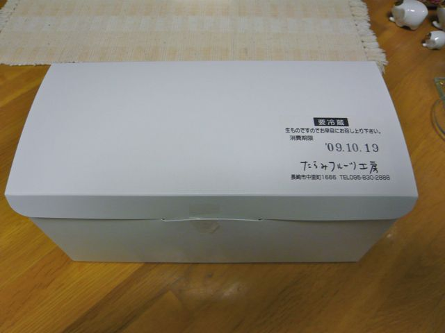
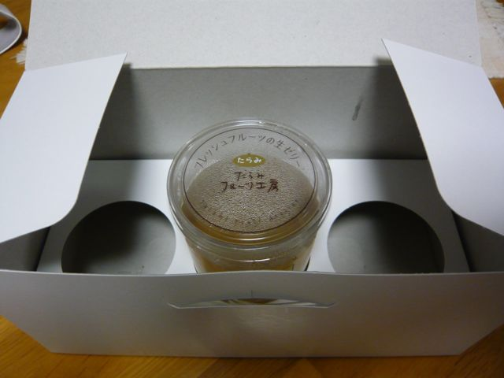

# [mixi] たらみの生ゼリー

**作成日:** 2009-10-19

今日は、「たらみフルーツ工房」で生ゼリーを買ってきました。

先月末にオープンしたのですが、場所が多良見ICの近くと市内から遠いので、なかなか行く機会がなく、初めての訪問でした。

商品は、フレッシュフルーツを使ったゼリー4種類くらいと、フルーツ入りヨーグルト（今日はバナナだった）とフレッシュジュース2種（売り切れてた）とあまり多くありませんでした。ゼリーは280円～400円。ぼちぼち季節がおわるピオーネを選びました。400円也。

一つしか買わなかったのですが、立派な箱と、手提げ袋に入れてもらいました。ゼリーは夕食後のデザートに食べましたが、ふるふるで、甘さ控えめのゼリーと、フレッシュな味わいのぶどうでした。ぶどうをそのまま食べた方がいいんじゃないか、という気もしないでもないですが、まあこれはこれ。

12月下旬まで長崎空港に出店してるそうです。

全国のたらみファンのみなさん、いかがですか～。

---

## イイネ (9)

- きたまこと
- KOHJI＠掬水月在手
- ゆみちん
- まほ
- タク
- Buddy
- ケルマデック
- YASUO
- さぁ

---

## コメント

**マイリスト**

マイミク一覧

**たらみの生ゼリー編集する**

2009年10月19日21:19

**2026年**

01月
02月
03月
04月
05月
06月
07月
08月
09月
10月
11月
12月