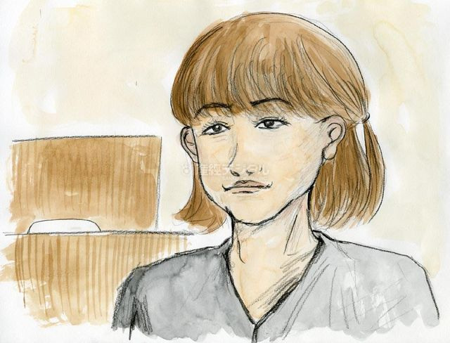
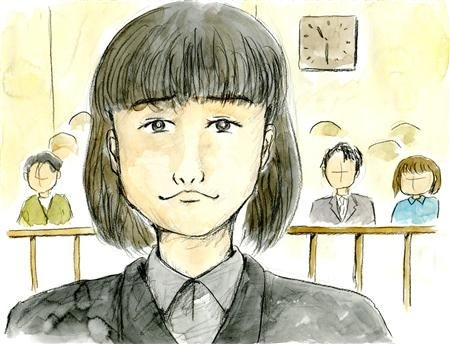
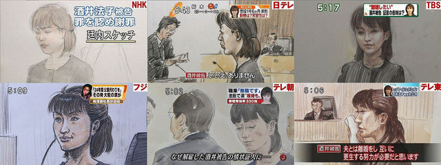

# [mixi] 法廷イラスト集

**作成日:** 2009-11-10

各社さまざまです。

ところで、判決の時、「現在主文読み上げ中です」みたいな中継をしてましたが、裁判って記者の出入りは自由なんですかねえ。

1枚目　話題の産経

2枚目　産経　練習の成果が出たようです

---

## イイネ (12)

- きたまこと
- KOHJI＠掬水月在手
- ゆみちん
- まほ
- タク
- Buddy
- arancio
- ぷち
- ケルマデック
- YASUO
- さぁ
- 退会したユーザー

---

## コメント

**マイリスト**

マイミク一覧

**法廷イラスト集編集する**

2009年11月10日01:02

**ぷち2009年11月10日 01:58**

TBSが一番似てますね～。
中継は記者2人がかりで、中の人が「これから読み上げの時間です」みたいに
外の人にメールかツイッターしてるとか？

**退会したユーザー2009年11月10日 09:58**

法定内は携帯は持ち込み禁止だと思いますが。

**ぷち2009年11月10日 14:11**

休憩時間に部屋の前で、って書くの忘れてました。
今は電源切ってればいいみたいですね。
http://
www.cou
rts.go.
jp/keng
aku/bot
yo_tebi
ki.html
http://
www.sai
banin.c
ourts.g
o.jp/qa
/c9_3.h
tml

**arancio2009年11月11日 19:30**

＞ぷちさん
産経の絵師さんによると、読売さんが一番うまいらしい。ここにないのが残念。
法廷画家今泉有美子さんに会う、の巻
http://
dailyvi
tamins.
jp/2009
/11/490
6/
報道は一般と別に確保されてるみたいなので、やっぱり出入り、もしくは複数の記者がいて一部退席とかしてるんでしょうね～。

**ぷち2009年11月15日 22:56**

さっきフジテレビのニュースに出てましたね～。
ふつうの女性記者さんという感じでした。

**2026年**

01月
02月
03月
04月
05月
06月
07月
08月
09月
10月
11月
12月
