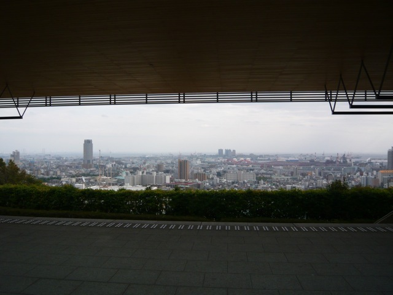
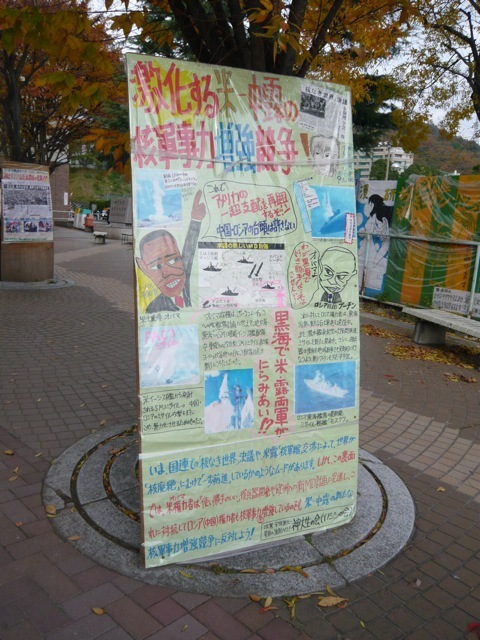
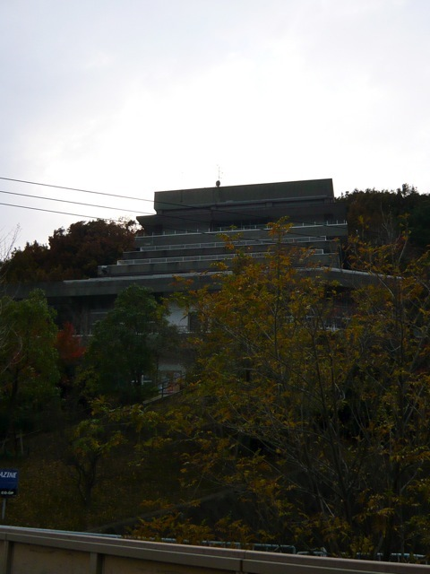

# [mixi] 久々の神大

**作成日:** 2009-12-02

先週末は、母校で学会があり、久々に足を踏み入れました。

土曜の午前中について、早めに六甲到着。

時間に余裕があったのでとんかつ「みやま」で定食を食べて、ケーニヒスクローネでお茶、歩いて国際文化学部まで行きました。建物がきれいになっている上に、新しい歩道が整備されていて、浦島太郎の気分でした。

出るつもりのなかった懇親会に出ることになり、終了後先生方に連れられて三宮へ移動。最後はなぜかお好み焼き屋。ちょっと飲み過ぎました。

日曜午後の公開シンポジウムが始まる前に、会場校挨拶があり、学長の代理で副学長が来てたのですが、紹介された副学長を見て、びっくり。軽音楽部の先輩でした。知らんかった～。

学会終了後、日曜の夜は鴻華園でベトナム料理を食べて、おとなしくホテルに帰りました。蒸し春巻き、おいしかった～。鴻華園は昔と変わらず安くておいしかったです。ぶっきらぼうな接客も相変わらず（笑）。

とりあえず、みやまのおっちゃんが元気で良かった。

ケーニヒスクローネの隣のポエムも健在だったな。

あと、Fも。

1枚目　百年記念館から

2枚目　こんなんもあります

3枚目　学生会館

---

## イイネ (13)

- きたまこと
- KOHJI＠掬水月在手
- ｱｷﾔﾏ(仮名)
- ゆみちん
- まほ
- タク
- Buddy
- arancio
- ぷち
- ケルマデック
- YASUO
- さぁ
- 退会したユーザー

---

## コメント

**マイリスト**

マイミク一覧

**久々の神大編集する**

2009年12月02日23:10

**ｱｷﾔﾏ(仮名)2009年12月02日 23:22**

よしだの床のネトネト具合はどうでしたか？
学生会館は変わりませんな。そのうち吹きに行きたい。

**arancio2009年12月02日 23:26**

みやまのネトネトは、思っていたよりましだったような気がする（笑）。
よしだはかなり前に閉店したみたいですね。
土曜は楽器の音が聞こえてきたけど、日曜の学館は誰もいてないみたいでした。入れないのかな？

**退会したユーザー2009年12月03日 00:27**

関東では、神大と言えば、神奈川大学なんですよ。（笑）

**arancio2009年12月03日 01:13**

名札に「神大」と書いていて、神奈川大学の人に間違えて声をかけられたことがあります。
ちなみに神戸大学は「しんだい」です。

**ぷち2009年12月03日 01:29**

鴻華園、蒸し春巻き、行きたいな～。
最後に行った時に、カニ？エビ？の炒め物だっけな？の残りタレに麺をからめるという
画期的においしい料理を食べたのですが、あれをまた食べてみたいです。
そのあと2軒目に行った串焼き屋も安くておいしかったです。
そういえば、「めいだい」も東京と愛知ではまったく別の大学ですね。

**arancio2009年12月03日 23:03**

カニまたはエビの炒め物の残りタレに麺をからめる料理、次行ったらトライします。それで思い出したけど、レタスの蝦みそ炒めも、おいしかったです～。
そういえば、地元の人は「めいえき」っていいますね～。

**2026年**

01月
02月
03月
04月
05月
06月
07月
08月
09月
10月
11月
12月
