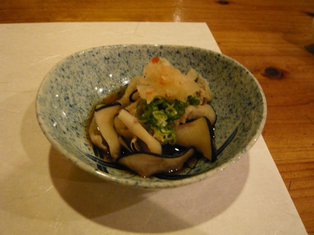
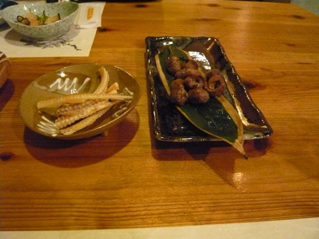
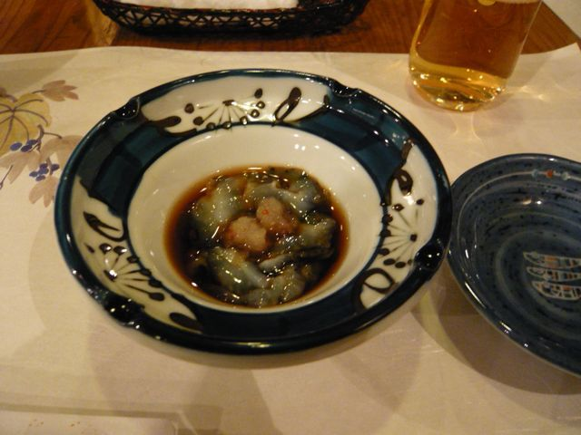

# [mixi] 珍味三種

**作成日:** 2009-12-21

週末県外からの来客が続いて、寿司（はあんまり食べてないけど
）連荘でした。穴子の肝は初めて食べたな～。

珍味三種。

その1 くじら

その2 穴子の肝と骨せんべい

その3 大村湾の青ナマコ、初物～。

---

## イイネ (13)

- きたまこと
- KOHJI＠掬水月在手
- 塾長
- ながいけ
- ゆみちん
- まほ
- タク
- Buddy
- arancio
- ケルマデック
- YASUO
- キュ～太郎
- さぁ

---

## コメント

**マイリスト**

マイミク一覧

**珍味三種編集する**

2009年12月21日10:31

**ながいけ2009年12月21日 11:59**

穴子の肝に興味津々。
長崎行こうかな。

**キュ～太郎2009年12月21日 12:18**

ラ船新年会やりますか

**arancio2009年12月21日 17:33**

＞ ながいけさん
穴子の肝は珍しいみたいです。
他には鯛の白子とか。
＞キュ～ちゃん
長崎で魚食べますか？
お店は↓だけど、他の店の話が多いなあ（笑）。
http://masaru2008.exblog.jp/

**塾長2009年12月21日 18:45**

あれ、長崎おったん？
笑

**arancio2009年12月21日 19:06**

明日（個人的に）仕事納めです。

**塾長2009年12月21日 19:36**

あ～まさるちゃんとこご無沙汰やから今度行ってこよっと

**arancio2009年12月21日 19:37**

今、ヤイト鰹おいしいですよ。

**2026年**

01月
02月
03月
04月
05月
06月
07月
08月
09月
10月
11月
12月