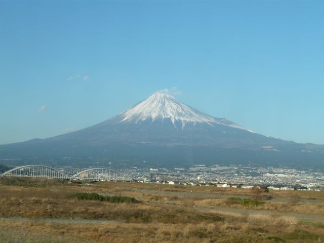
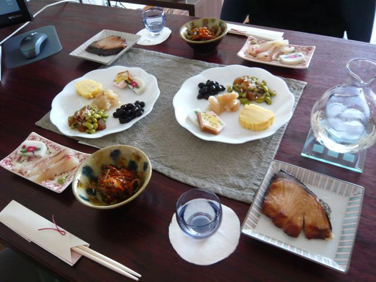

# [mixi] あけましておめでとうございます

**作成日:** 2010-01-02

みなさま、あけましておめでとうございます。

今年もよろしくお願いします。

今年は東京でお正月を迎えました。

年末は仙台、年始は豊橋に行って帰ってきました。

新幹線の車窓から見た今日の富士山です。

ばたばたしましたが、おせちもできました。

この時点では煮しめを出し忘れてました

---

## イイネ (14)

- きたまこと
- KOHJI＠掬水月在手
- chicken
- ゆみちん
- まほ
- タク
- Buddy
- arancio
- ぷち
- ケルマデック
- YASUO
- キュ～太郎
- さぁ
- テル

---

## コメント

**マイリスト**

マイミク一覧

**あけましておめでとうございます編集する**

2010年01月02日18:44

**テル2010年01月02日 18:48**

富士山，いいですねえ。
ご利益ありそうな雄姿です。

**arancio2010年01月02日 18:53**

富士山、かっこいいですねえ。
年末、東京に来る時は飛行機から見ましたが、まさに霊峰富士という感じの凄い存在感でした。静岡から千葉上空、羽田着陸寸前までず～っと見えてました。

**キュ～太郎2010年01月02日 19:33**

今年も宜しくお願いします～
ラ船オフ@長崎したいです

**chicken2010年01月02日 20:42**

あけましておめでとうございます。
それにしても何て旨そうな御節！
料亭みたいっす。食べれる人が羨ましいっす。

**ぷち2010年01月02日 21:41**

あけましておめでとうございます。
鰤が立派ですね～！（笑）
今日、夕暮れ時に首都高を走ってたら逆光の富士山がとてもきれいでした。

**arancio2010年01月03日 14:44**

＞キュ～ちゃん
魚食いオフ企画しましょうかねえ。
＞ chickenさん
料亭みたいとはうれしいおことばです。ありがとうございます。
なんせ初めてだったので大変でした。
＞ぷちさん
走ってますね～。三が日は首都高すいてるのかな？気持ち良さそうですね。
鰤は脂がのってておいしかったです。魚焼きグリルで焼いたら、意外と手間がかかりませんでした。

**2026年**

01月
02月
03月
04月
05月
06月
07月
08月
09月
10月
11月
12月
