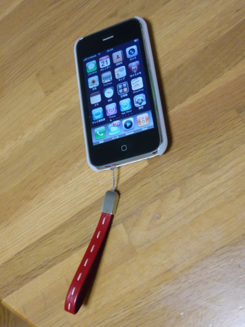

# [mixi] Life with iPhone

**作成日:** 2010-01-21

iPhoneを使い始めて2週間弱。やっとケース、ストラップも揃いました。

ストラップは、かなり前に注文してたんですが、番地の間違いでいったん返送になったりしてて、今日やっと届きました。wolfさんに教えてもらったネジでつけるタイプです。色はイタリアン・レッド。私の力ではネジがちゃんと取り付けられてないのですが、強度は問題なさげだし、同期・充電できてるので、まあ大丈夫かな。

PHSをまだ持ってるので、APN disablerというのでパケット代をおさえて使ってます。3Gのパケット通信をおさえるプロファイルで、通話、SMSは使えます。位置情報サービスは使えるので、今日は試しにEveryTrailというGPSロガーアプリを使ってみたら、経路記録中に地図が表示されなかったけど、帰宅して確認したら記録はちゃんと取れてました。

なんでGPSロガーを使ってみたかというと、職場の高度を知りたかったのです。とりあえず積年の謎がとけて満足
。EveryTrailでGPSデータを作成して、デジカメで撮った写真に埋め込むこともできるみたいなので、旅行にでも行ったら挑戦してみよう。iPhoneのカメラで撮れば、そんなことしなくてもGPSデータ入ってますけど、まあ一回くらいは挑戦してみたい
。EveryTrailのサイトはいろんな人のTripが写真つきで公開されててなかなか楽しい。

iPhoneのカメラアプリ、今、いろいろ試してます。

無料とか115円とかのソフトしか使ってないので、そこそこの価格でもこれは買っとけ、があったらお知らせ下さい。

---

## イイネ (12)

- きたまこと
- KOHJI＠掬水月在手
- まほ
- ゆみちん
- タク
- Buddy
- arancio
- ケルマデック
- 跳びたい乃豚
- YASUO
- さぁ
- 退会したユーザー

---

## コメント

**マイリスト**

マイミク一覧

**Life with iPhone編集する**

2010年01月21日23:53

**退会したユーザー2010年01月22日 11:15**

Camera Genius、Snaptureあたりはどうでしょうか。
標準カメラは保存は早いのですが、その分、圧縮率が高いようですね。

**arancio2010年01月22日 23:42**

さっそく情報ありがとうございます。
Snaptureおもしろいですねえ。サイズを簡単に変更して撮れるのは便利そう。
Camera Geniusはアプリ提供元が無料のTripodというのを出してるのでしばらくそちらを使ってみます。
写真加工アプリも、無料でいろいろあって楽しめます。

**跳びたい乃豚2010年01月24日 12:50**

アイモーションと
TiltShiftGenと
LEGOのやつですな

**arancio2010年01月27日 15:26**

LEGOはタップでドミノ倒しみたいに色が変わって楽しいけど、LEGOにあいそうな写真を撮るのが難しい。
TiltShiftはすごくかわいい。
アイモーションは使いこなせそうにありません
。

**2026年**

01月
02月
03月
04月
05月
06月
07月
08月
09月
10月
11月
12月
