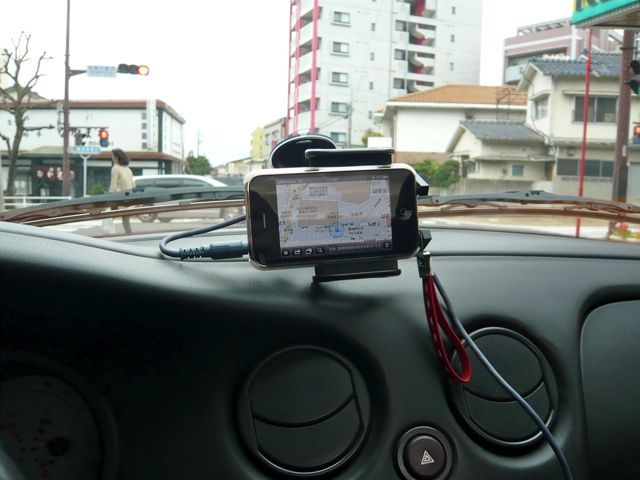

# [mixi] iPhoneのナビアプリ

**作成日:** 2010-02-25

カーナビは必要ないと思ってたのですが、iPhoneで115円のNaviCatというアプリを見つけて試してみたくなりました。

まずはiPhoneの車載ホルダーを購入。

量販店で見かけるiPhone車載ホルダーは、エアコン送風口につけるものがほとんどでバルケッタには無理っぽいので、アマゾンで安いカーマウントホルダーを注文してみました。取り付けてみるまで不安でしたが、予想よりはしっかりした作りで、実用に耐えそうです。香港メーカーの製品でした。

ちょうど使用期限が近づいた嬉野のホテルの利用券があったので（笑）、ランチを嬉野で食べて、伊万里まで行ってみました。有田まではちょこちょこ行くのですが、伊万里はビミョーに不便で行ったことがなかったので、ナビに道案内をまかせて足を伸ばしてみました。

起動が遅いのはご愛嬌ですが、使えると思います。音声案内は英語ですが、Turn rightとかその程度。交差点は、日本語で大きめの文字で表示されるので見易いです。走行中は簡易地図ですが、交差点は詳細表示がされるのでわかりやすかったです。オートリルートは苦手みたいでした。バッテリはがんがん減ります。15分で10%くらいかな。1日使おうと思ったら、シガーから充電が必須です。

伊万里では、窯元が集まっている町の入口に伊万里鍋島焼会館というのがあって、そこに車を置いて窯元を歩いて回ることができました。有田より高級な感じかな。初めて行ったので買うつもりはなかったのですが、結局、すごく味がある骨董風の湯呑茶碗を二つ買いました。一つ500円
。でも手書き！もうちょっと買っても良かったかな。タコ唐草（大好きなんですよね）の模様の箱に入れてもらって大満足。

画面はNaviCatではなく、カーナビっぽいという無料のアプリです。

---

## イイネ (11)

- きたまこと
- KOHJI＠掬水月在手
- まほ
- ゆみちん
- タク
- Buddy
- arancio
- ケルマデック
- YASUO
- さぁ
- 退会したユーザー

---

## コメント

**マイリスト**

マイミク一覧

**iPhoneのナビアプリ編集する**

2010年02月25日23:13

**arancio2010年02月25日 23:25**

あ、そうそう、嬉野を出たあたりで完全に圏外になって、iPhoneのナビは郊外では使えないかと思いましたが、波佐見の中心部で復活して、後は大丈夫でした。
町中は町中で、建物のせいでGPS受信に問題出たりするのかな？

**退会したユーザー2010年02月25日 23:51**

NaviCatって、猫に関連したアプリかと思いました。
猫の写真が出るとか、「次は右だニャン！」とか猫語で言ってくれるとか・・・。（爆）

**arancio2010年02月25日 23:54**

猫好きの人は絶対買いますね。
猫がナビだったら、道案内も気分でさぼったりしそう。

**退会したユーザー2010年02月26日 01:28**

猫がナビだったら、間違ってても、許してのんびりしそう。（笑）

**arancio2010年02月26日 17:48**

猫ですからね～。

**2026年**

01月
02月
03月
04月
05月
06月
07月
08月
09月
10月
11月
12月