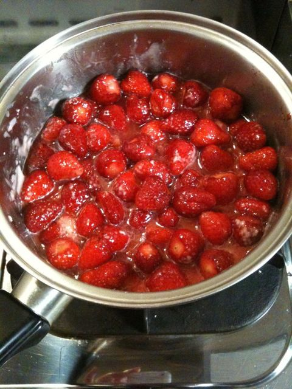
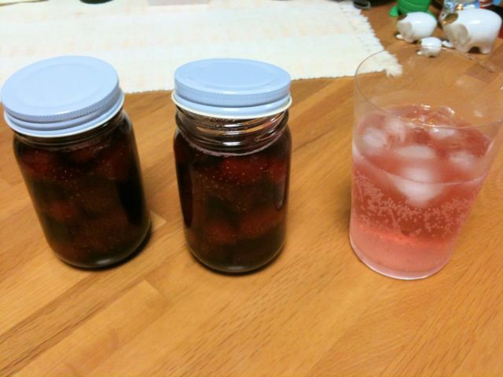

# [mixi] いちごジャムを作る

**作成日:** 2010-03-27

ランチを食べに出かけるついでに、買い物に行ったら、いちごが1パック100円だったので、2パック買ってジャムを作ることにした。レモンは3個で100円。両方、長崎産。

長崎のいちごは、さちのかが多いです。福岡にいる頃はとよのか食べてましたが、最近はもっぱらさちのか。酸味が程よくあるのが好き。

ヨーグルトについてるグラニュー糖が久々に大量消費できて良かった。

1枚目　加熱前

2枚目　できあがり

---

## イイネ (11)

- きたまこと
- KOHJI＠掬水月在手
- ゆみちん
- まほ
- タク
- Buddy
- arancio
- ぷち
- ケルマデック
- YASUO
- さぁ

---

## コメント

**マイリスト**

マイミク一覧

**いちごジャムを作る編集する**

2010年03月27日22:39

**ぷち2010年03月28日 00:28**

おいしそうですね～。
今日スーパーでいちご特売してましたが、
消費しきれなそうだったので断念しました…
余ったらジャムにすればよいのだけど、1パック500円の
いちごでやる勇気もなく(笑)

**arancio2010年03月28日 01:29**

1パック500円はジャムにはできませんね～。
いちごが終わったら、ぶどう（巨峰）の季節です。
ぶどうが安くなるのは、もうちょっと先だなあ。

**2026年**

01月
02月
03月
04月
05月
06月
07月
08月
09月
10月
11月
12月
