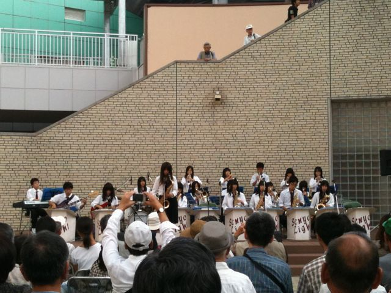

# [mixi] 和泉の国ジャズストリート2010

**作成日:** 2010-09-28

26日(日)に和泉中央駅会場に出演してきました。

私達のバンド Mod-Concept Jazz Orchestraのライブはなんと2年ぶり。

前回のライブも和泉の国ジャズストリートでした。

お客さんが多かったので、びっくり。高齢の人が多かったのと、写真コンテストをしてるせいか、ごついカメラを持った人がけっこういましたねえ。

持ち時間40分を少しオーバーしましたが、楽しかったです。

例によって2週間くらい前から、練習を始めました。

曲数が10曲というのもきつかったですが、新曲にGroove Merchantがって、これは長いサックスソリがあって、かなりの難物。譜面が届いてから一生懸命練習しましたが、結局、演奏時間の関係でボツになりました。8割方ボツだろうと思ってたんですが、2割の方にかけて練習しないという勇気はありませんでした

出番が早かったので、14時頃に早々に解散。

16時頃から、後輩達の演奏をみるためにしばらく時間つぶし。

すご～く久しぶりに後輩達の演奏をみました。

残ったOBは私を入れて4名。

総勢29名、1年から3年まで、曲によってメンバーは異なりますが、全員出演。

私達の頃もそうだったけど、パートを固定しないで、曲ごとに変えてました。

難しい曲やってましたねえ。

入部時は初心者が多いのに、9月末に1年生を入れて、あれだけの演奏って、夏休みどんだけ練習してたんだって感じです。若さって凄い。

あいかわらず中庭で合奏してるみたいですが、音楽室で練習させてあげたいなあ。

---

## イイネ (11)

- きたまこと
- KOHJI＠掬水月在手
- ゆみちん
- まほ
- タク
- Buddy
- れい
- arancio
- YASUO
- さぁ
- 大ちゃん＠ﾗﾃﾝ大阪

---

## コメント

**マイリスト**

マイミク一覧

**和泉の国ジャズストリート2010編集する**

2010年09月28日19:22

**大ちゃん＠ﾗﾃﾝ大阪2010年09月29日 23:25**

お疲れ様でした。
Groove Merchantは僕が言いだしっぺになってるらしいです
。
難しいわりに、難しそうに聞こえない曲ですよね。バッチリ決まったら
気持ちいいんでしょうが、ナカナカ一筋縄ではいきそうにないですね～。

**arancio2010年09月30日 21:04**

まさか言いだしっぺだったとは
。
ゆったりテンポだけど、ねちねち続いて難しいんですよね。
さて、次の機会はあるのだろうか。

**2026年**

01月
02月
03月
04月
05月
06月
07月
08月
09月
10月
11月
12月
