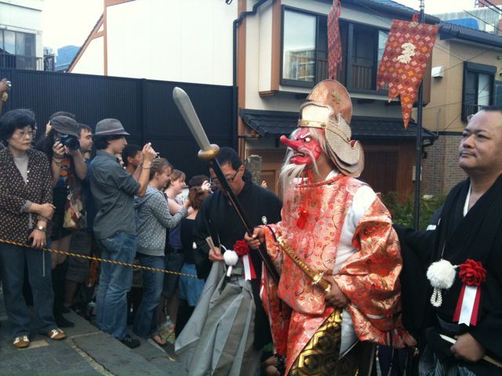
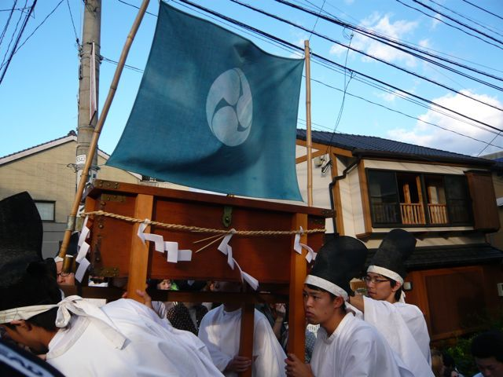
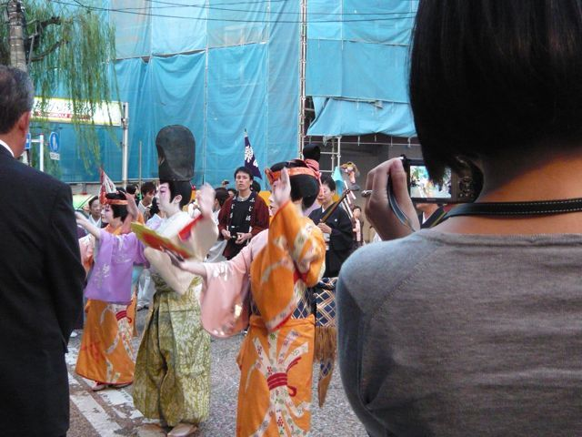

# [mixi] おくんち

**作成日:** 2010-10-15

今年はおくんちの後日（最終日）が土曜だったので、初めて見物に出かけました。

三つのご神体（お神輿）が諏訪神社に戻る「お上り」をみましたが、紋付き袴に山高帽のおじいさん達が素敵でした。ご神体と一緒に、さい銭箱も移動してるのには笑った。

それぞれの踊り町が、寄付をしてくれた店や家をまわる「庭先周り」というのがあって、町のあちこちで踊りなどを披露しています。寄付が大きいところだと、長くいたりするそう。たまたま、福砂屋の本店に買い物に行ったら、築町の本踊り（踊り手が3人プラス地方、鳴り物）に遭遇しました。3曲踊っていったよ～。

パチンコ屋なんかにもまわってた。義理でがんじがらめって感じで、よく考えると怖いですw。

祭りといえば、だんじりか、ふとん太鼓見たいな～。

だんじり一台につき数百人いて、いったい何人曳いてるねん、みたいなのが見たい。

長崎の神輿、コッコデショは堺のふとん太鼓が伝わったもの、だそう。

知らなかった～。

1枚目　お上り　天狗は猿田彦だって。

2枚目　お上り　さい銭箱

3枚目　福砂屋前にて

---

## イイネ (11)

- きたまこと
- KOHJI＠掬水月在手
- みにすけ
- ゆみちん
- まほ
- タク
- Buddy
- れい
- arancio
- YASUO
- さぁ

---

## コメント

**マイリスト**

マイミク一覧

**おくんち編集する**

2010年10月15日21:20

**みにすけ2010年10月15日 23:32**

くんちって長崎にもあるんですね。
仕事柄、唐津くんちの話をよく聞くので、佐賀の祭だと思ってました。唐津くんちは確か、来月？
まだ唐津くんちも見れてないんです、宿が取れなくて(泣)

**arancio2010年10月16日 01:38**

くんちは、長崎、唐津、博多にあります。
くんちは、9日のことです。
唐津のくんちは11月ですね。
チャンスがあれば行ってみたいな～。

**2026年**

01月
02月
03月
04月
05月
06月
07月
08月
09月
10月
11月
12月