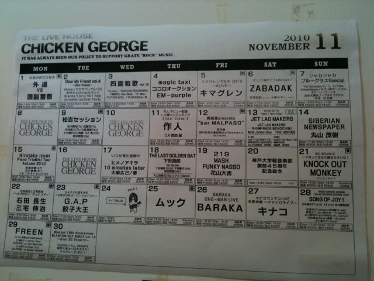
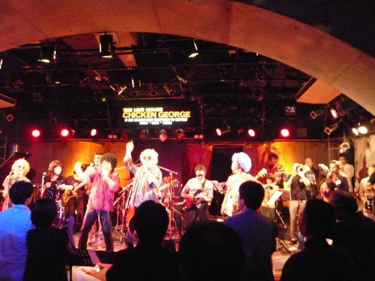

# [mixi] Kobe Mussoc Premium Jazz Orchestra

**作成日:** 2010-11-24

週末は、チキン・ジョージで軽音楽部創部45周年記念のOB総会に参加しました。

現役バンドが神戸マソックジャズオーケストラなので、「偽物、ぱちもん」（by ごんぞう）の我々は神戸マソックプレミアムジャズオーケストラを名乗っての出演でした。

約5年ぶりにマソックのメンバーが集まり、練習は前日の1回のみで本番というチャレンジングな企画でしたが、えらい盛り上がりで演奏を終えることができました。あんなにノリがいい観客は初めてってくらいノリが良かったです。あったかかったなあ。久しぶりに1番を吹くのでかなりのプレッシャーだったんですが、大きなミスなく演奏を終えられてほっとしてます。April in ParisのF#出て良かった
。

前日の練習は23時頃終え、「明日に差し支えないよう軽めに」といいつつ、結局飲み放題で制限時間いっぱい飲み食いしてました。医師2名に「ふぐの肝はうまいから食っとけ」とさかんに勧められました。人工呼吸さえできれば、心配ないそうです。

リハの時は、先輩方が並んでる前での演奏で、気分はすっかり1年坊主でめちゃくちゃ緊張しました。この年になって、こんな試練にぶちあたるとは完全に予想外でした
。

出番はトップだったので、後は楽しく飲んでさわいでました。卒業して20年、創部45年の軽音楽部では、ど真ん中の世代に属してるわけですが、創部した先輩方の演奏を聴いて、人生まだまだ楽しめるなあと元気が出ました。ラストは、アース・ウィンド・アンド・ファイヤーのセプテンバーで大ダンス大会。楽しかった～。

終了後、手羽先とハワイアンフード（謎の組み合わせだった）のお店で打ち上げ。

昔のライブの映像を観ながら、飲んでました。神戸市内にホテルが取れなくて、打ち上げ途中で抜けたのだけが心残りです。

イベントの企画、準備をして下さった皆さんには感謝です。

次回（50周年か？）も参加できるといいなあ。

リハからずっと神大トレーナーを着てニコニコ受付してはった人が、副学長って知らなかった人たくさんいそう。偉い人は腰が低くてよく働くを実感しました。

昔の映像を収めたお土産DVDもあるし、当日の録音が翌日にはメールで送られてきたり、YouTubeに動画があがってたり、イベントはまだ続いてる感じです。

---

## イイネ (13)

- きたまこと
- KOHJI＠掬水月在手
- ｱｷﾔﾏ(仮名)
- ゆみちん
- まほ
- わた
- KotetsU
- タク
- Buddy
- れい
- arancio
- YASUO
- さぁ

---

## コメント

**マイリスト**

マイミク一覧

**Kobe Mussoc Premium Jazz Orchestra編集する**

2010年11月24日23:45

**イイネ！（2）**

うっちー

**KotetsU2010年11月24日 23:50**

S理事ですね～。

**arancio2010年11月25日 00:25**

そうそう。

**わた2010年11月25日 13:28**

＞リハからずっと神大トレーナーを着てニコニコ受付してはった人が、副学長って
まじかっ！？　どうしよ・・・　失礼がなかったかしら、私・・・。
何人かのメールを読んで、はっ！って気づいたんだけど、sax陣が山野初出場のメンバーのフルバンって、たぶん13年ぶり（T雄の結婚式フルバン以来）やったんやわ。それ以降は毎回誰か欠けてたりして。どおりでなんかしっくりくると思った。
arancioさんの
＞特にサックスパートのみなさんには、ひたすら感謝です。
のことばには、ぐっときました。
こちらこそ感謝ですよ。
・・・年をとるとこんなにいたわりあうものなんですね

**arancio2010年11月25日 15:16**

13年振りでしたか～。
T雄の結婚式の時も、レギュラーメンバーでオールナイトでしたねえ。
もっちゃんの結婚式で吹けなかったのはすごく残念。
学生時代の行いを反省し始めたのはわりと最近になってからです
。
一生懸命で悪気はなかったけど、イヤな奴だったろうな～と。
年をとると丸くなるって、こういうことかも。

**わた2010年11月25日 16:31**

えー
これ以上泣かせるようなことを言わないで・・・
arancioさんと私は、普段べったり仲良しさんではなかったけど、思い起こせば、いざというときは（卒業してからも）いつもかばってくれたし、守ってくれたこと、よく覚えていますよ。
そういう意味では、arancioさんと、おさるさんには頭があがりません、実は。
・・・私なんて、まだ学生時代の行いの反省始めてないのに

**KotetsU2010年11月25日 17:13**

良いなあ、こういうＯＢ総会って。
僕も最後の５年生の時は、チャリオとマソックを掛け持ちしてたんだけどなー。

**ｱｷﾔﾏ(仮名)2010年11月25日 20:37**

お疲れ様でした。バンド全体もですがサックスはなかなかグーだったのではないですかね。Straight AheadもAprilも譜面とは違うニュアンスで吹いてて難しかったと記憶してましたが、数年ぶりのご対面で確かこうだったよなと思って音出したらバッチリはまって嬉しかったです。
tbの後輩T氏のメールにあったノリに関する話も興味深かったですね。

**arancio2010年11月25日 21:38**

＞わたさん
別に反省しなくていいですよ～。
今回、同期にもれなく連絡してもらってみんな喜んでると思います。
一番苦労したのはT雄かもしれませんね～。
まあ娘ちゃんがあんなにべたべたしてて幸せそうだからいいか。
＞こてつ
いい会でしたよ～。
こてつがいてても、全く違和感なかったと思う。
＞アキヤマさん
お疲れさまでした。
ほとんどぶっつけ本番でしたが、本番が一番うまくいったのは年の功ってところでしょうか。
ノリはマソックのDNAってやつかもしれません。

**2026年**

01月
02月
03月
04月
05月
06月
07月
08月
09月
10月
11月
12月
