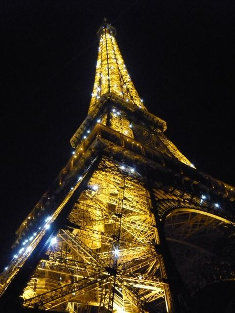

# [mixi] フランスデビュー

**作成日:** 2011-01-10

年末、初めてフランスに行ってきました。

1日デジョンまで出かけましたが、それ以外はパリ市内をうろうろしてました。

約1週間あっという間でしたが、楽しかったです。

旅行を決めたのが2月で、その頃からフランス語の勉強も始めました。

夏休みに完全に止まってしまったのですが、秋になんとか持ち直して、挫折せずに続けることができました。英語の方が実用に耐えるけど、フランス語も少しは使えてまあ満足。カフェ○、レストランの予約△、レストランの注文×ってところ。

よく旅行会話に出てくる道案内の会話は、「答えがわかるわけないので、道を聞いたりしない」からムダかと思ってましたが、トイレの場所を教えてもらう時に役立ちました。フランス語わからなくても、なんとかなるんですけどね。

今回の心残りは

・オペラ座のシャガールを観られなかった（滞在最終日に見学に行ったが、今日は見学終わりと言われた）

・モンマルトルに行けなかった

の二つかな。

旅行の話はぼちぼち日記に書けたら書きます。

帰国しても、フランス熱はさめず、iPhone, iPadでフランス語関係のアプリをいれたりしています。遅咲きフランスデビュー、です。今年の目標の一つは、フランス語を中級レベルにする、かな。

写真はいわずもがなのエッフェル塔です。時々LEDをきらきらさせ、サーチライトもぐるぐるしてて、思ってたより派手でした。到着日に、上り口を選ばず入場してしまい、ところどころ凍りついてる階段を徒歩で展望台まで上がりました。登った甲斐はあって、パリの街は美しかったです。下りはエレベーターが使えました。

---

## イイネ (12)

- きたまこと
- KOHJI＠掬水月在手
- ゆみちん
- まほ
- タク
- Buddy
- Kiririn
- れい
- arancio
- ぷち
- YASUO
- さぁ

---

## コメント

**マイリスト**

マイミク一覧

**フランスデビュー編集する**

2011年01月10日17:10

**イイネ！（3）**

退会したユーザー

**Kiririn2011年01月10日 18:05**

さすがっ！！！arancioさんは、いつもすごいっすね～。
広く深く深く。めっちゃ尊敬しま～す。
フランス語を勉強してレストランで食事、いいですね。
オペラ座のシャガール、知らなかった。いちど見てみたい！

**arancio2011年01月10日 19:11**

レストランでフランス語は上級レベルじゃないと太刀打ちできなさそうです。
食べ物の名前はめちゃくちゃ難しい。 英語でも怪しいもんだし。
フランス料理食べまくってれば覚えられるかな
そうそう、フランスで覚えた英単語 "gizzard"。鶏の砂肝。フランス語でgésier。
前菜によく出てくるみたい。
フランスで食べた砂肝は、色がうすくてやわらかかったです。

**ぷち2011年01月11日 00:14**

お菓子の名前から入ると、フランス語は拒否反応が薄らぐ(笑)ような気がします。
ガトーなんとか、クレーム・ア・ラ・なんとか、ショコラなんとか…なじみのあるものが多いので。
食べ物の名前がわかるようになると、レストランやデパートがだいぶ楽しくなりますね。
あとは冠詞ですかね…かくいう私も学生時代の第2外国語レベルですが（汗）
ところでクリスマス期のパリはちゃんと遊べましたか？ロンドンはどこも閉まって全滅でした…

**arancio2011年01月11日 00:31**

ロンドンは全滅ですか。パリはちょっと心配だったけど、大丈夫でした。
到着の翌日が日曜で、シャンゼリゼの店は半分以上閉まってる感じでしたが、プジョーのショールームがあいてたり、セフォラでお買い物したりして、それほど困らなかった。でも、ラファイエットもプランタンも休みだったのには参りました。デパートが日曜定休って。
ホリデーシーズンって感じで、にぎやかで楽しかったです。逆に、ヴェルサイユで入場券を買うのに1時間以上並んだりでそれはちょっと大変でした。

**2026年**

01月
02月
03月
04月
05月
06月
07月
08月
09月
10月
11月
12月