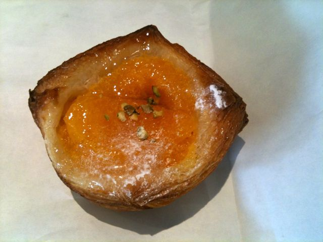
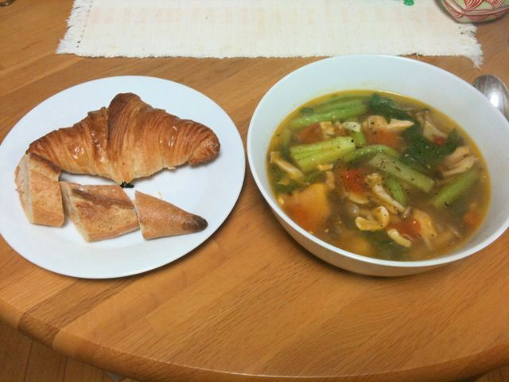

# [mixi] 久々に新規開拓

**作成日:** 2011-03-29

今日は仙川のラトリエ ドミニク・サブロンへ行ってきた。

初めて行くお店なので、クロワッサンと小さいバゲットとオレンジのデニッシュを買ってみた。計672円。クロワッサンが焼き上がって間も無い時間に入店したみたいで、ラッキーでした。店員さんと少し話をしたけど、接客も良かった。

最近文春にクロワッサンランキングの記事が出てたようで、そのトップ5がこんな感じ。

1位 エシレ・メゾン デュ ブール

2位 ドミニク・サブロン

3位 メゾンカイザー

4位 ル・プチメック

5位 ヴィロン

ドミニク・サブロンのクロワッサンは、塩気がきいてて、バターの味もしっかりするけど、べたべたするようなこともなく、かなりおいしい。エシレのは食べたことないけど、なんとなく想像がつく。

バゲットは皮も中身も両方もちもちって感じで、好みが分かれそうな感じ。

ヴィロンのバゲットの方がおいしいと思うけど、扱いがかなり面倒なので、家で食べるのは雑に扱っても大丈夫そうなドミニク・サブロンのバゲットでいいかな～って感じ。

こぶりのオレンジのデニッシュは、クロワッサンの生地を使ってるので、塩がきいた生地とオレンジの酸味とカスタードの甘さの組み合わせが楽しかった。

上の5軒のうち、パンの味、コスパ、買いにいきやすさを考えるとドミニク・サブロンが一番かも。ヴィロンはおいしいけど、近所にあったら、お財布にも体にも悪そうだ。

今出川のル・プチメックが大好きで、京都に泊まる時は朝食を食べに行ったりしてたけど、長いこと行ってないなあ。

新宿のプチメックは（東京価格としては）安くておいしいけど、イートインがないのと新宿駅から遠いのが難。あと、デパートらしく明るい店内なんですが、今出川の暗めで、たくさんの種類のパンがごちゃっと並んでる感じが好きなのでこれもちょっと残念。

デニッシュは3時のおやつに食べて、クロワッサンとバゲットも今日中に食べてみようということで、夕食は冷蔵庫の残りものでスープを作って食べた。東京のおいしいパンを買うのはGWまでお預けです。

---

## イイネ (9)

- きたまこと
- KOHJI＠掬水月在手
- ゆみちん
- まほ
- タク
- Buddy
- れい
- YASUO
- さぁ

---

## コメント

**マイリスト**

マイミク一覧

**久々に新規開拓編集する**

2011年03月29日00:48

**イイネ！（1）**

大ちゃん＠ﾗﾃﾝ大阪

**2026年**

01月
02月
03月
04月
05月
06月
07月
08月
09月
10月
11月
12月
