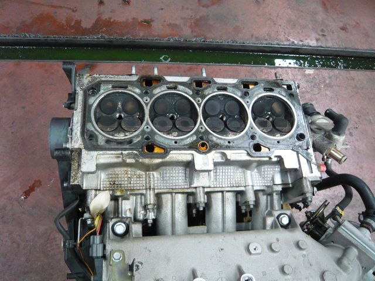
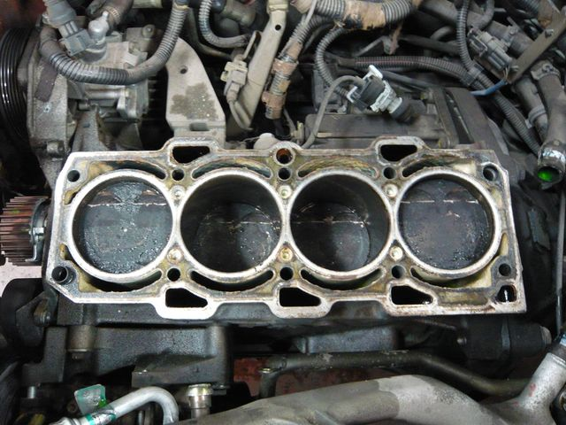

# [mixi] エンジン見てきました

**作成日:** 2011-05-29

やっとエンジン開けてもらいました。

写真の手前側のバルブが全部浮いていました。

シリンダーの方はまだ確認が済んでいないので、エンジン載せ替えが必要かどうか判断できないと言われましたが、現在見える範囲では、目立った傷はないとのこと。

明日の午前中に修理に関する交渉をする予定なんですが、明日までに調べてくるつもりかどうか、面倒なので聞きませんでした。

フルサイズの写真は下記にあります。

https:/
/picasa
web.goo
gle.com
/aranci
o3355/B
archett
aEngine
2011052
9?authk
ey=Gv1s
RgCK-mh
I6w1oet
wgE&fea
t=direc
tlink

---

## イイネ (11)

- きたまこと
- KOHJI＠掬水月在手
- ゆみちん
- まほ
- タク
- Buddy
- れい
- arancio
- YASUO
- さぁ
- 退会したユーザー

---

## コメント

**マイリスト**

マイミク一覧

**エンジン見てきました編集する**

2011年05月29日19:37

**退会したユーザー2011年05月30日 01:42**

やっぱり、予想した通り、吸気側のバルブが全てシリンダーヘッドと接触した跡がありますね・・・。バルブが変形ぢているはずですが、バルブ単体の画像がないのは何故？
まぁ問題はどのタイミングでバルブ変形が起きたかですね。

**arancio2011年05月30日 03:25**

作業がここまででした。前日にも連絡して、当日も1時間以上前に行くと連絡してたんですが。

**退会したユーザー2011年05月30日 12:23**

エンジン降ろしてやってるのかぁ。そりゃ手間だわ。いくら電話しようが他車の作業と並行と考えればそこまでひどくはないと思うが。
まぁ、通常のバルブクラッシュの修理代かかるな。どうせここまでしてるなら、何キロ乗ってるかしらんけどシリンダーボーリングでピストンも新しく入れ替えるとほぼリフレッシュできる。

**退会したユーザー2011年05月30日 14:36**

降ろしちゃないんじゃ？ヘッド取っただけでしょ｡
腰下いじったら三桁いっちまうて。

**arancio2011年05月30日 17:04**

> wolfさん
エンジンは降ろしてません。
頼んでから、10日近くかかりましたね。
> KITTENさん
腰下いじると三桁なんですね。それは怖い。

**退会したユーザー2011年05月30日 20:36**

そっか。
ま、どのみち10日だったら普通だな。
なんかナーバスになってるみたいだけど、対応の仕方はともかく、どこに出しても作業の進行状況はそんなもんだとおもう。
しかし、コンクールコンディションとかレア車ならともかく、量産フィアットの旬過ぎた車なんて気軽に乗り換えていくほうが気兼ねなくていいと思うがなぁ。どうしてもこの車種なら他にも安くあるわけだし。よほど思い入れが強いんですね。
まぁ、きてーんのようにわざわざｘ1/9にAT積む人もいるわけだがｗ

**arancio2011年05月30日 20:54**

う～ん、乗り換えにあんまり興味わかないんですよねえ。
車好きじゃないのかも。

**退会したユーザー2011年05月30日 23:33**

三桁行くのはチューニングとか重整備すればの話だけですが、腰下いじるといえば、そーいう話が普通なもんで・・・。昔のエンジンならクランクシャフトのメタルベアリングを交換するだけとかもあるけど・・・。

**arancio2011年05月30日 23:44**

バルケッタも現代車ってことですね。

**2026年**

01月
02月
03月
04月
05月
06月
07月
08月
09月
10月
11月
12月