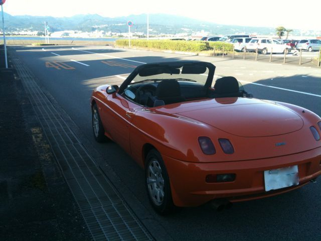
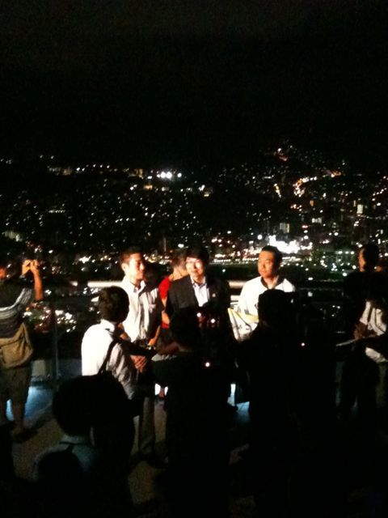
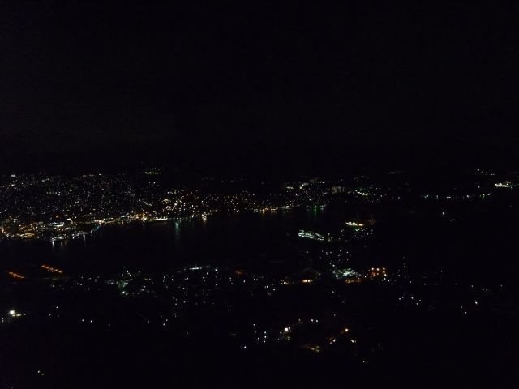

# [mixi] バルケッタの帰還、プチドライブ

**作成日:** 2011-07-30

7月4日にJAFに来てもらって、工場を移動して、待つこと3週間ちょっと。今日の夕方バルケッタを引き取ってきました。4月20日板金修理に出してから3ヶ月、やっと帰ってきました。

車を運転するのも2ヶ月ぶりで、工場をこわごわ出たのが6時前。遠出はちょっと不安だけど、そのまま長崎市内に戻るには早いので、大村湾沿いを走って長崎空港へ。

長崎空港は海上にあるので、海の上を走ってキーウェスト気分。行ったことないけど。6時を過ぎて、日差しがやわらいできたので、オープンにして、再び夕暮れの大村湾沿いを走って長崎市内へ。今日はからっと晴れてて、絶好のオープン日和でした。

長崎市街へたどりついた7時過ぎには風も涼しくなってきて、稲佐山に向かいました。以前の稲佐山展望台は、一般車入場禁止だったのですが、中腹からのロープウェイが廃止されて、今年から入場可になったので、一度は行ってみようと思ってたのでした。

ちょうど暗くなった頃に稲佐山についたら、観光客がいっぱい、長崎さるく関係のテレビ取材陣がいたりで、展望台の駐車場がほぼ満車になるくらい盛況でした。外国人観光客も、日本人観光客もたくさんいました。お子様がたは夏休みですもんねえ。

展望台に上がったとたんに田上市長のインタビュー撮影が始まりました。他に二人男性がいたけど、一人はテレビによく出てる国際弁護士の八代って人だと思う。旅行番組かなんか？ 売店でニューヨーク堂（地元のお菓子屋さん）抹茶アイスもなかを買って食べ、展望台で数枚写真を撮って、展望台を出ました。

車からちょっと離れたところで写真を撮ってたら、観光タクシーの運転手に案内されたご夫婦が通りかかりました。熊本からきたご夫婦らしく、運転手さんが「熊本から2時間半くらいですか～」と意外と近いことに驚いた調子で言った直後にバルケッタに気がつき、「京都ナンバー！」と驚いてはったんですけど、すみません、地元ですと心の中であやまっておきました。

帰りは中腹にあるホームセンターで少し買い物をして、リンガーハットでちゃんぽんを食べて帰ってきました。車って便利。久々に駐車場に車を置いて、夜空を見上げたら星がすごくきれいでした。ここ2ヶ月はバスにあわせて明るいうちに帰宅するようにしてたので、夜空を見上げる余裕もなかったのかあとしんみりしました。

新しいエンジンは前より静かで、クラッチもスムーズになった気がするけど、とにかくいろいろ久しぶりなので、よくわかりません。

ちなみに今回のエンジン・クラッチ交換の請求は約12万円で、ベラボーな金額にならずほっとしました。

オチが一つあります。

今日が前期の終講日だったんですよね。昨日の夕方、修理完了の電話をもらった時はちょっと脱力でした。

まあ、採点だけで大学に行くのは億劫なのでいいんですけど。

---

## イイネ (14)

- きたまこと
- KOHJI＠掬水月在手
- Jane Birkin
- ゆみちん
- まほ
- BeBopCat
- Buddy
- タク
- れい
- 西日　いちみん
- arancio
- ごみりん
- YASUO
- さぁ

---

## コメント

**マイリスト**

マイミク一覧

**バルケッタの帰還、プチドライブ編集する**

2011年07月30日00:03

**イイネ！（7）**

ぷち

**西日　いちみん2011年07月30日 09:13**

おめでとうございます。
静かになったのは、タイミングバリエータがへたってたからとか
だったりして。
んでも、やっとですね～～～。
これで出かけまくれますねっ。

**ごみりん2011年07月30日 10:34**

おめでとうございます。
これで、バルケッタDAY参加できますね(￣▽￣)

**arancio2011年07月30日 17:21**

> いちみんさん
ありがとうございます～。
走行10万オーバーなので、へたっててもおかしくないですね。
＞ごみりんさん
ありがとうございます～。
バルケッタDAYか～、行きたいんですけどねえ。

**Jane Birkin2011年07月30日 21:57**

バケラッタ(^ヮ^)
おめでとうございます！
そういやうちの義兄は大学の教授です。
ちょっとした共通点(^ヮ^)

**BeBopCat2011年07月30日 22:01**

おめでとうございます！ 久しぶりに乗ると、あぁ、やっぱこれだって思いますよね。

**arancio2011年07月31日 00:26**

＞ Janeさん
ありがとうございます。
私は教授じゃないですけどね～。
＞ BeBopCatさん
ありがとうございます。
ほんとに乗ってるだけで楽しいですね。
バルケッタに乗って長崎に来たなあと、長崎に着いた日のことを思い出しました。

**2026年**

01月
02月
03月
04月
05月
06月
07月
08月
09月
10月
11月
12月