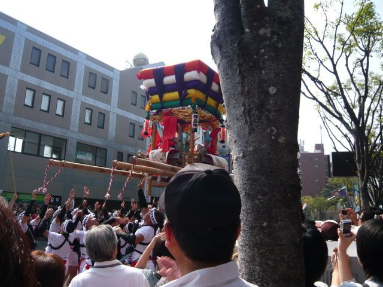

# [mixi] おくんち見物　コッコデショ

**作成日:** 2011-10-09

朝から諏訪神社へくんち見物に行って来ました。前日飲み会で、神社近くに住んでる友人のお宅に泊めてもらったんですが。

諏訪神社は参道が長い石段で、登り切ったところに境内があるのですが、途中に踊り馬場と呼ばれる広場があり、そこで各踊り町が演し物を奉納します。踊り町は7年に一回の出演なので、毎年違った演し物が観られます。

有料の観覧席は全て売り切れ、以前はいくつか無料で入って観られるポイントがあったそうですが、今日行ってみたら全部塞がれてて踊り馬場を近くで観るのはあきらめて、踊り馬場に入場する前に待機する休憩所あたりで、傘鉾見物などをしてました。

友人の友人に傘鉾の中を見せてもらったり、踊り手さんと記念撮影をしてると、一番人気の樺島町の太鼓山（コッコデショ）が来ました。とりあえず、諏訪神社の参道の階段の下の方に移動すると、遠くだけど、踊り馬場が一応見えたのでそこで見物。

奉納が終わり、庭先回り（商店の店頭などで演し物をする）に出る太鼓山を見送りました。そして庭先回りがある料亭富貴楼前に向かいました。

https://www.youtube.com/watch?v=RksQJW8UtUQ

コッコデショ一番の見せ場は、かけ声とともに太鼓山を投げ上げるところ。

空中にあがったところ、撮れましたが、前のおじちゃんがちょっと残念です。

去っていくところは動画を撮ってみました。

https://www.youtube.com/watch?v=AaUz8eVmCP8

コッコデショの次の行き先は眼鏡橋がある中島川沿いの中華料理店でしたが、そこもすでにたくさんの人が待ち構えてましたが、十分堪能したので見物はせず、帰途につきました。

コッコデショが出るのは、7年に一回なので、今年観ることができて良かったです。

（追記）

踊り馬場の奉納はこんな感じ。

最初に出てくる傘鉾は、止まってる時でも誰か一人が中で支えていて、大変そうでした。傘立て的なものは存在しない
。傘鉾はすべての踊り町にあって、それぞれ違う飾りです。

https://www.youtube.com/watch?v=vRlc3HXl35Y

---

## イイネ (9)

- きたまこと
- KOHJI＠掬水月在手
- ゆみちん
- まほ
- タク
- Buddy
- れい
- YASUO
- さぁ

---

## コメント

**マイリスト**

マイミク一覧

**おくんち見物　コッコデショ編集する**

2011年10月09日17:06

**2026年**

01月
02月
03月
04月
05月
06月
07月
08月
09月
10月
11月
12月
